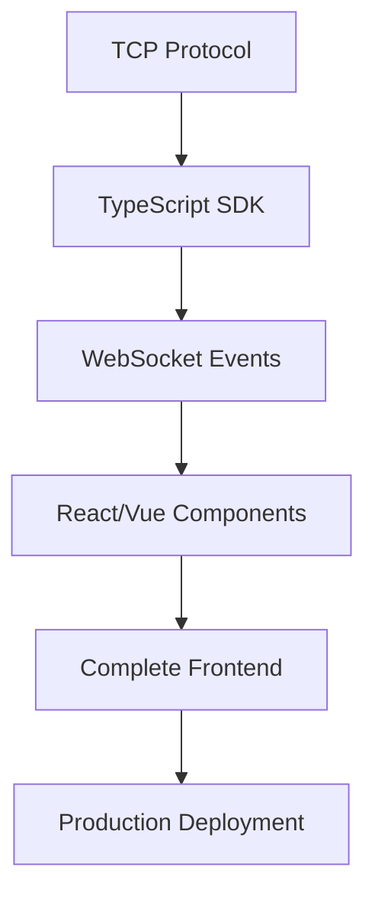

# 🚀 SniperForge Enterprise API Documentation

## 📖 Índice

- [🎯 Estado Deseado Declarativo](#estado-deseado-declarativo)
- [🤖 Control de Bots](#control-de-bots)  
- [📊 Métricas y Monitoreo](#métricas-y-monitoreo)
- [🔧 Configuración](#configuración)
- [🛠️ CLI Interactivo](#cli-interactivo)
- [📡 TCP Server](#tcp-server)
- [🎮 Modo Demo](#modo-demo)

---

## 🎯 Estado Deseado Declarativo

SniperForge implementa un **sistema declarativo** donde defines el estado deseado en YAML y el sistema se encarga de converger automáticamente.

### Conceptos Clave:

- **Desired State**: Estado objetivo definido en `config/system.yaml`
- **Current State**: Estado actual del sistema
- **Reconciliation**: Proceso automático que hace que Current State = Desired State
- **Drift Detection**: Detección de diferencias entre estado actual y deseado

### Configuración YAML:

```yaml
desired_state:
  reconciliation:
    enabled: true
    interval_seconds: 30
    max_retries: 3
    timeout_seconds: 300
  
  bots:
    - id: "arbitrage-btc-001"
      type: "arbitrage"
      desired_status: "running"
      config:
        pairs: ["BTC/USDT"]
        exchanges: ["binance", "kraken"]
        min_profit_threshold: 0.015
        max_position_size: 5000.0
      resources:
        max_cpu: 1.0
        max_memory_mb: 512
```

---

## 🤖 Control de Bots

### Estados de Bot:

| Estado | Descripción | Transiciones Permitidas |
|--------|-------------|------------------------|
| `Stopped` | Bot detenido completamente | → Running, Paused |
| `Running` | Bot ejecutando trabajo real | → Stopped, Paused, Maintenance |
| `Paused` | Bot pausado (listo pero sin ejecutar) | → Running, Stopped |
| `Maintenance` | Bot en modo mantenimiento | → Stopped |
| `Error` | Bot en estado de error | → Stopped |

### Tipos de Bot:

#### 1. **Arbitrage Bot**
```yaml
type: "arbitrage"
config:
  pairs: ["BTC/USDT", "ETH/USDT"]
  exchanges: ["binance", "kraken", "coinbase"]
  min_profit_threshold: 0.015  # 1.5%
  max_position_size: 5000.0    # USD
  execution_timeout_ms: 3000
```

**Funcionalidad Real:**
- Escanea oportunidades de arbitraje entre exchanges
- Ejecuta trades automáticos cuando encuentra profit > threshold
- Simula trabajo real con métricas de trading reales

#### 2. **ML Analytics Bot**
```yaml
type: "ml-analytics"
config:
  analysis_interval_seconds: 300
  prediction_horizon_hours: 24
  confidence_threshold: 0.85
  models: ["lstm", "transformer", "ensemble"]
```

#### 3. **Sentiment Analysis Bot**
```yaml
type: "sentiment"
config:
  sources: ["twitter", "reddit", "telegram"]
  update_interval_seconds: 60
  sentiment_threshold: 0.6
  language_filter: ["en", "es"]
```

---

## 📊 Métricas y Monitoreo

### Tipos de Métricas:

#### 1. **Trading Metrics**
```typescript
interface TradingMetrics {
  trades_executed: number;
  successful_trades: number;
  total_pnl_usd: number;
  success_rate: number;        // 0-1
  avg_profit_per_trade: number;
  total_volume_usd: number;
  sharpe_ratio?: number;
}
```

#### 2. **Performance Metrics**
```typescript
interface PerformanceMetrics {
  cpu_usage_percent: number;
  memory_usage_mb: number;
  network_io: NetworkIOMetrics;
  api_calls: ApiCallMetrics;
  avg_response_time_ms: number;
  throughput_per_second: number;
}
```

#### 3. **Operational Metrics**
```typescript
interface OperationalMetrics {
  uptime_seconds: number;
  restart_count: number;
  last_restart?: string;       // ISO datetime
  config_updates: number;
  error_count: number;
}
```

### Sistema de Alertas:

```typescript
// Alertas automáticas basadas en métricas
if (success_rate < 0.8) {
  alert("⚠️ Bot API success rate low: {success_rate}% - may need attention");
} else if (success_rate > 0.95) {
  log("✅ Bot performing excellently: {success_rate}% success rate");
}
```

---

## 🔧 Configuración

### Jerarquía de Configuración:

1. **system.yaml** - Configuración principal
2. **Environment Overrides** - Por entorno (dev/prod/test)
3. **Environment Variables** - Variables de entorno
4. **Runtime Config** - Configuración en tiempo de ejecución

### Variables de Entorno Soportadas:

```bash
SNIPERFORGE_TCP_PORT=8888
SNIPERFORGE_HTTP_PORT=8080  
SNIPERFORGE_LOG_LEVEL=debug
SNIPERFORGE_DATA_DIR=./state
SNIPERFORGE_DEMO_MODE=1      # Activa modo demo
```

### Hot-Reload:

El sistema soporta **hot-reload** automático:
- Detecta cambios en `system.yaml`
- Recarga configuración sin reiniciar
- Aplica cambios automáticamente

---

## 🛠️ CLI Interactivo

### Navegación Estilo Directorio:

```bash
sniperforge:/ $ cd /bots
sniperforge:/bots $ ls
arbitrage-btc-001    [Running]   ✅ Healthy
arbitrage-eth-001    [Running]   ✅ Healthy  
ml-analytics-001     [Running]   ⚠️  Warning
sentiment-monitor-001 [Stopped]  ⏸️  Stopped

sniperforge:/bots $ cd arbitrage-btc-001
sniperforge:/bots/arbitrage-btc-001 $ status
🤖 Bot Status: arbitrage-btc-001
├── Status: Running
├── Type: arbitrage
├── Uptime: 2h 34m 15s
├── Trades: 45 (100% success)
├── Profit: $234.56
└── Health: Healthy
```

### Comandos Contextuales:

| Contexto | Comandos Disponibles |
|----------|---------------------|
| `/` | `cd`, `ls`, `help`, `exit` |
| `/bots` | `cd`, `ls`, `start-all`, `stop-all`, `status` |
| `/bots/{bot_id}` | `start`, `stop`, `restart`, `status`, `logs`, `config` |
| `/system` | `backup`, `restore`, `health`, `metrics` |
| `/monitoring` | `dashboard`, `alerts`, `performance` |

### Comandos Avanzados:

```bash
# Stop con opciones
stop --force          # Parada forzada
stop --verbose         # Información detallada
stop --graceful        # Parada elegante

# Start con configuración
start --config-override '{"min_profit_threshold": 0.02}'

# Monitoring en tiempo real
monitor --live         # Dashboard en vivo
monitor --bot arbitrage-btc-001  # Monitor específico
```

---

## 📡 TCP Server

### Protocolo de Comunicación:

**Puerto:** 8888 (configurable)  
**Formato:** JSON sobre TCP  
**Encoding:** UTF-8

### Comandos TCP:

#### 1. **Control de Bots**
```typescript
// Crear Bot
{
  "command": "CreateBot",
  "bot_type": "arbitrage",
  "config": { /* BotConfig */ }
}

// Iniciar Bot
{
  "command": "StartBot", 
  "bot_id": "uuid",
  "config": { /* BotConfig */ }
}

// Detener Bot
{
  "command": "StopBot",
  "bot_id": "uuid"
}
```

#### 2. **Consultas de Estado**
```typescript
// Listar Bots
{
  "command": "ListBots"
}

// Estado de Bot
{
  "command": "GetBotStatus",
  "bot_id": "uuid" 
}

// Métricas de Bot
{
  "command": "GetBotMetrics",
  "bot_id": "uuid"
}
```

#### 3. **Operaciones Masivas**
```typescript
// Iniciar todos los bots
{
  "command": "StartAllBots"
}

// Detener todos los bots
{
  "command": "StopAllBots"
}

// Estado de recursos del sistema
{
  "command": "GetResourceStatus"
}
```

### Respuestas TCP:

```typescript
// Respuesta exitosa
{
  "type": "Success",
  "message": "Operation completed successfully"
}

// Lista de bots
{
  "type": "BotList",
  "bots": [
    {
      "id": "uuid",
      "name": "arbitrage-btc-001", 
      "type": "arbitrage",
      "status": "Running",
      "health": "Healthy"
    }
  ]
}

// Error
{
  "type": "Error", 
  "message": "Bot not found"
}
```

---

## 🎮 Modo Demo

### Activación:

```bash
export SNIPERFORGE_DEMO_MODE=1
cargo run
```

### Funcionalidades Demo:

- **Bot de Demostración**: Crea automáticamente un MockArbitrageBot
- **Datos Simulados**: Genera métricas y trades realistas
- **Configuración Segura**: Usa configuraciones de desarrollo
- **Testing**: Perfecto para pruebas del frontend

### Datos de Ejemplo:

```typescript
// Bot de demo creado automáticamente
{
  id: "demo-arbitrage-001",
  name: "Demo Arbitrage Bot",
  type: "arbitrage",
  status: "Running",
  metrics: {
    trades_executed: 127,
    successful_trades: 125,
    total_pnl_usd: 1234.56,
    success_rate: 0.984,
    uptime_seconds: 3661
  }
}
```

---

## 🔌 Integración Frontend

### Flujo Recomendado para SDK:

#### 1. **Conexión TCP**
```typescript
class SniperForgeSDK {
  private tcpClient: TCPClient;
  
  async connect(host = 'localhost', port = 8888) {
    this.tcpClient = new TCPClient(host, port);
    await this.tcpClient.connect();
  }
}
```

#### 2. **Gestión de Estado**
```typescript
// Estado reactivo para frontend
interface AppState {
  bots: Bot[];
  systemMetrics: SystemMetrics;
  desiredState: DesiredState;
  reconciliationStatus: ReconciliationStatus;
}

// Auto-sync con backend
const sdk = new SniperForgeSDK();
const state = reactive<AppState>({
  bots: [],
  systemMetrics: null,
  desiredState: null,
  reconciliationStatus: null
});

// Polling automático
setInterval(async () => {
  state.bots = await sdk.listBots();
  state.systemMetrics = await sdk.getSystemMetrics();
}, 1000);
```

#### 3. **Declarative State Management**
```typescript
// Editar estado deseado desde frontend
async updateDesiredState(newState: DesiredState) {
  await sdk.updateDesiredState(newState);
  // El sistema se encarga de la reconciliación automática
}

// Monitorear reconciliación  
sdk.onReconciliation((event: ReconciliationEvent) => {
  console.log('Reconciliation:', event);
  state.reconciliationStatus = event;
});
```

#### 4. **Componentes Reactivos**
```vue
<!-- Dashboard Component -->
<template>
  <div class="dashboard">
    <BotGrid :bots="state.bots" />
    <MetricsPanel :metrics="state.systemMetrics" />
    <DesiredStateEditor :state="state.desiredState" />
    <ReconciliationStatus :status="state.reconciliationStatus" />
  </div>
</template>
```

---

## 🎯 Siguiente Pasos para SDK

### Características Prioritarias:

1. **✅ Completado**: TCP Protocol & Commands
2. **✅ Completado**: Declarative State System  
3. **✅ Completado**: Metrics & Monitoring
4. **🔄 En Progreso**: Comprehensive Documentation
5. **📋 Pendiente**: TypeScript SDK Generation
6. **📋 Pendiente**: WebSocket Real-time Updates
7. **📋 Pendiente**: Frontend Components Library
8. **📋 Pendiente**: Authentication & Security

### Roadmap Técnico:



---

## 📞 Soporte y Contacto

- **Documentación**: `/docs/`
- **Ejemplos**: `/examples/`
- **Testing**: `SNIPERFORGE_DEMO_MODE=1`
- **CLI**: `cargo run --bin sniperforge-interactive`

---

*Documentación generada para SniperForge Enterprise v5.8.1*  
*Última actualización: Agosto 6, 2025*
