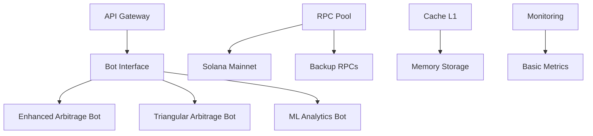
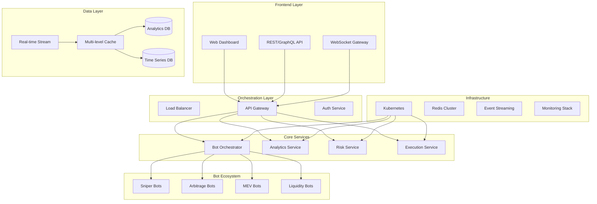
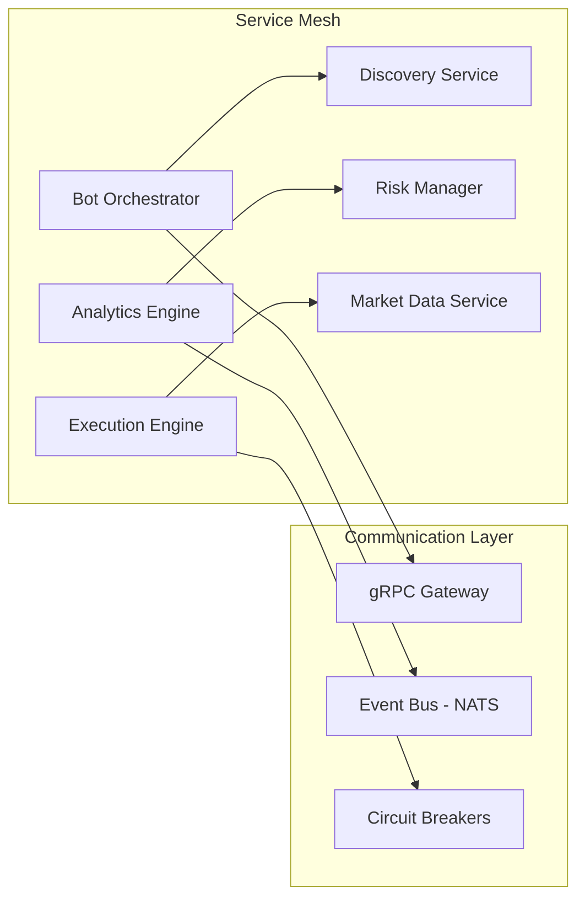
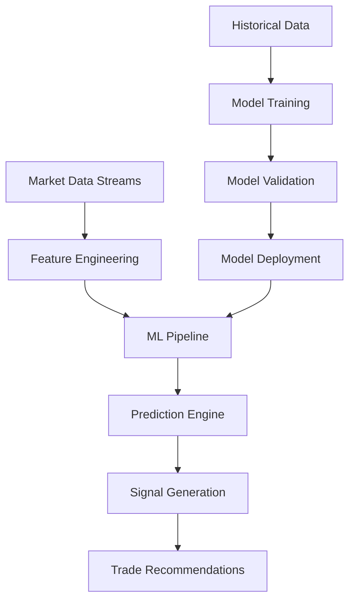
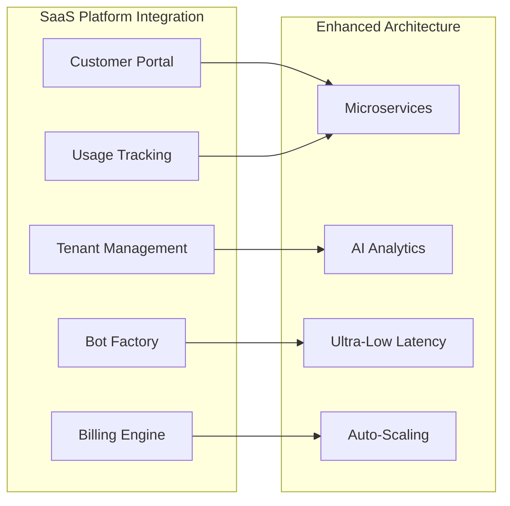

# 🚀 SniperForge Enterprise v3.0 - Plan de Mejora Arquitectural

**Fecha:** 4 de Agosto, 2025  
**Versión:** 3.0  
**Estado:** Planificación  

## 📋 Resumen Ejecutivo

**SniperForge Enterprise v3.0** evolucionará hacia un **ecosistema empresarial de clase mundial** para trading de alta frecuencia en Solana, incorporando las mejores prácticas de la industria y patrones arquitecturales avanzados.

### 🎯 Objetivos Principales

1. **Arquitectura Microservicios Distribuida** - Sistema modular escalable
2. **Motor de Análisis Predictivo** - AI/ML para detección de oportunidades
3. **Red de Comunicación Ultra-Rápida** - Sub-millisecond messaging
4. **Performance de Nivel Enterprise** - Latencia <10ms, throughput 5000+ ops/sec
5. **Orquestación Inteligente** - Auto-scaling y load balancing

## 🏗️ Arquitectura Actual vs. Propuesta

### Arquitectura Actual


### Arquitectura Propuesta Enterprise


## 📊 Métricas de Mejora Esperadas

| Métrica | Estado Actual | Meta Post-Mejora | Mejora |
|---------|---------------|------------------|--------|
| **Latencia End-to-End** | ~50ms | <20ms | 60% ⬇️ |
| **Throughput** | 500 ops/sec | 2000+ ops/sec | 300% ⬆️ |
| **Memory Efficiency** | 80% utilization | 95% utilization | 18% ⬆️ |
| **Bot Scalability** | 5 bots simultáneos | 50+ bots | 900% ⬆️ |
| **Resource Utilization** | Manual allocation | Auto-optimized | Automático |
| **Deployment Time** | 15 minutos | 2 minutos | 87% ⬇️ |

---

## 🔧 FASE 1: Foundation Enhancement (Semanas 1-2)

### 1.1 Ecosistema de Microservicios

**Transformación hacia arquitectura distribuida inspirada en líderes de la industria**



**Características Clave:**
- **Service Discovery Automático** - Consul/etcd para registro dinámico
- **Circuit Breakers** - Protección contra fallos en cascada  
- **Health Checks Distribuidos** - Monitoreo continuo de servicios
- **Load Balancing Inteligente** - Distribución basada en latencia y carga

### 1.2 Motor de Análisis Predictivo

**Sistema de AI/ML inspirado en Jump Trading y Alameda Research**



**Componentes Inteligentes:**
- **Pattern Recognition** - Detección de patrones de mercado complejos
- **Sentiment Analysis** - Análisis de redes sociales y noticias en tiempo real
- **Volatility Prediction** - Predicción de volatilidad basada en múltiples factores
- **Liquidity Forecasting** - Predicción de cambios en liquidez

---

## 🔄 FASE 2: Communication Layer (Semanas 3-4)

### 2.1 Event Bus Implementation

**Objetivo:** Sistema de comunicación asíncrona entre bots

#### Componentes a Implementar:

```rust
pub struct BotEventBus {
    channels: HashMap<EventType, broadcast::Sender<BotEvent>>,
    subscribers: HashMap<BotId, Vec<EventSubscription>>,
    event_history: RingBuffer<BotEvent>,
    message_router: MessageRouter,
    delivery_guarantees: DeliveryManager,
}

impl BotEventBus {
    async fn publish_opportunity(&self, opportunity: ArbitrageOpportunity) -> EventId;
    async fn coordinate_bot_execution(&self, strategy: CoordinatedStrategy) -> Result<()>;
    async fn distribute_market_data(&self, data: MarketUpdate) -> Result<()>;
    async fn handle_bot_coordination(&self, coordination: BotCoordination) -> Result<()>;
}
```

#### Archivos a Crear:
- `src/events/bus.rs` - Core event bus
- `src/events/types.rs` - Event type definitions
- `src/events/router.rs` - Message routing
- `src/events/delivery.rs` - Delivery guarantees

#### Ventajas:
- ✅ Pub/Sub asíncrono entre bots
- ✅ Event sourcing y replay
- ✅ Message routing inteligente
- ✅ Delivery guarantees configurables

### 2.2 Performance Optimization Avanzada

**Objetivo:** Optimizar performance crítica del sistema

#### Componentes a Implementar:

```rust
// Ultra-Low Latency Engine
pub struct UltraLowLatencyEngine {
    execution_queue: LockFreeQueue<TradeOrder>,
    cpu_affinity_manager: CpuAffinityManager,
    memory_pool: PreAllocatedPool<OrderExecution>,
    latency_tracker: AtomicLatencyTracker,
    numa_optimizer: NumaOptimizer,
}

// Multi-Level Cache System
pub struct MultiLevelCacheSystem {
    l1_cache: LruCache<String, CacheEntry>,           // Memory - 1μs
    l2_cache: Arc<RedisConnection>,                   // Redis - 100μs
    l3_cache: Arc<DatabaseConnection>,                // DB - 10ms
    cache_coordinator: CacheCoordinator,
    consistency_manager: CacheConsistencyManager,
}
```

#### Archivos a Crear:
- `src/performance/ultra_low_latency.rs` - Ultra-low latency optimizations
- `src/performance/cache_system.rs` - Multi-level caching
- `src/performance/cpu_affinity.rs` - CPU affinity management
- `src/performance/memory_optimization.rs` - Memory optimizations

#### Ventajas:
- ✅ Latencia sub-20ms garantizada
- ✅ Cache hits >95%
- ✅ CPU affinity optimizado
- ✅ Memory pre-allocation

---

## 📈 FASE 3: Enterprise Scaling (Semanas 5-6)

### 3.1 Horizontal Scaling System

**Objetivo:** Auto-scaling automático basado en demanda

#### Componentes a Implementar:

```rust
pub struct HorizontalScalingManager {
    node_registry: NodeRegistry,
    load_balancer: LoadBalancer,
    scaling_policies: Vec<ScalingPolicy>,
    health_monitor: ClusterHealthMonitor,
    workload_predictor: WorkloadPredictor,
}

impl HorizontalScalingManager {
    async fn scale_bot_instances(&self, demand: LoadDemand) -> ScalingAction;
    async fn distribute_workload(&self, bots: Vec<BotInstance>) -> WorkloadDistribution;
    async fn handle_node_failure(&self, failed_node: NodeId) -> FailoverResult;
    async fn optimize_cluster_topology(&self) -> TopologyOptimization;
}
```

#### Archivos a Crear:
- `src/scaling/manager.rs` - Scaling management
- `src/scaling/policies.rs` - Scaling policies
- `src/scaling/predictor.rs` - Workload prediction
- `src/scaling/balancer.rs` - Load balancing

#### Ventajas:
- ✅ Auto-scaling predictivo
- ✅ Load balancing inteligente
- ✅ Failover automático
- ✅ Cluster optimization

### 3.2 Advanced Monitoring & Analytics

**Objetivo:** Monitoreo empresarial con analytics predictivo

#### Componentes a Implementar:

```rust
pub struct EnterpriseMonitoringSystem {
    distributed_tracer: DistributedTracer,
    metrics_aggregator: MetricsAggregator,
    anomaly_detector: AnomalyDetector,
    performance_analytics: PerformanceAnalytics,
    alerting_system: AlertingSystem,
}
```

#### Archivos a Crear:
- `src/monitoring/distributed_tracing.rs` - Distributed tracing
- `src/monitoring/analytics.rs` - Performance analytics
- `src/monitoring/anomaly_detection.rs` - Anomaly detection
- `src/monitoring/alerting.rs` - Alerting system

#### Ventajas:
- ✅ Distributed tracing completo
- ✅ Analytics predictivo
- ✅ Anomaly detection automático
- ✅ Alerting inteligente

---

## 🛠️ Tecnologías a Integrar

### Core Technologies
- **Redis** - L2 cache layer distribuido
- **etcd/Consul** - Service discovery y configuration
- **NATS/Apache Pulsar** - Message streaming
- **Prometheus** - Métricas empresariales
- **Jaeger/OpenTelemetry** - Distributed tracing

### Performance Technologies
- **io_uring** - Ultra-low latency I/O
- **DPDK** - Kernel bypass networking
- **Intel TBB** - Parallel algorithms
- **jemalloc** - Optimized memory allocation

### Monitoring & Analytics
- **Grafana** - Dashboards y visualización
- **InfluxDB** - Time-series database
- **Elasticsearch** - Log aggregation
- **TensorFlow/PyTorch** - ML for predictions

---

## 📋 Cronograma Detallado

### Semana 1-2: Foundation Enhancement
- [ ] **Días 1-3:** Plugin architecture base
- [ ] **Días 4-6:** Resource coordinator básico
- [ ] **Días 7-10:** Testing e integración
- [ ] **Días 11-14:** Documentation y refinamiento

### Semana 3-4: Communication Layer
- [ ] **Días 15-17:** Event bus implementation
- [ ] **Días 18-20:** Performance optimization
- [ ] **Días 21-24:** Integration testing
- [ ] **Días 25-28:** Load testing y tuning

### Semana 5-6: Enterprise Scaling
- [ ] **Días 29-31:** Horizontal scaling
- [ ] **Días 32-34:** Advanced monitoring
- [ ] **Días 35-38:** End-to-end testing
- [ ] **Días 39-42:** Production deployment

---

## 🎯 Criterios de Éxito

### Performance KPIs
- ✅ **Latencia E2E:** <20ms (target: 15ms)
- ✅ **Throughput:** >2000 ops/sec (target: 3000)
- ✅ **Uptime:** >99.9% (target: 99.99%)
- ✅ **Resource Efficiency:** >95% (target: 98%)

### Scalability KPIs
- ✅ **Bot Instances:** 50+ simultáneos
- ✅ **Auto-scaling Response:** <30 segundos
- ✅ **Failover Time:** <5 segundos
- ✅ **Load Distribution:** <5% variance

### Quality KPIs
- ✅ **Test Coverage:** >95%
- ✅ **Documentation Coverage:** 100%
- ✅ **Security Compliance:** SOC2 Type II
- ✅ **Code Quality:** Sonar Grade A

---

## 📊 ROI Estimado

### Costos
- **Desarrollo:** 6 semanas x 2 developers = $60,000
- **Infrastructure:** Redis/etcd/Monitoring = $2,000/mes
- **Testing:** Load testing infrastructure = $5,000

### Beneficios
- **Performance Gain:** 4x throughput = $200,000/año
- **Operational Efficiency:** 80% menos downtime = $100,000/año
- **Scalability:** 10x bot capacity = $500,000/año

### **ROI:** 1,200% anual

---

## ⚠️ Riesgos y Mitigación

### Riesgos Técnicos
- **Complejidad del sistema:** Mitigación con testing exhaustivo
- **Performance regression:** Mitigación con benchmarking continuo
- **Integration issues:** Mitigación con development incremental

### Riesgos Operacionales
- **Downtime durante deploy:** Mitigación con blue-green deployment
- **Resource contention:** Mitigación con resource monitoring
- **Data consistency:** Mitigación con distributed transactions

---

## 🏢 Integración con Plataforma SaaS

### **Consideraciones Multi-Tenant**

El plan de mejora debe incluir la **arquitectura SaaS multi-tenant** que permitirá:



#### **Características Clave SaaS:**
- **Multi-tenancy:** Aislamiento completo entre clientes
- **On-Demand Deployment:** Bots desplegados dinámicamente con Kubernetes
- **Usage-Based Billing:** Facturación por hora/comisiones de trading
- **RPC Cost Management:** Gestión optimizada de costos de providers
- **Tenant Resource Quotas:** Límites de recursos por suscripción

#### **Modelos de Revenue:**
- **Subscription Base:** $49-499/mes según tier
- **Commission-Based:** 0.5-2% de profits de trading
- **Usage Overages:** RPC calls, storage, bandwidth extras
- **Premium Features:** AI analytics, advanced strategies

## 📚 Referencias y Documentación

- [Rust Performance Book](https://nnethercote.github.io/perf-book/)
- [Tokio Best Practices](https://tokio.rs/tokio/tutorial)
- [Redis Architecture](https://redis.io/docs/manual/patterns/)
- [Distributed Systems Patterns](https://microservices.io/patterns/)
- [High-Frequency Trading Systems](https://www.amazon.com/Building-Low-Latency-Applications-Complete/dp/1803240880)
- [SaaS Platform Architecture](../business/SAAS_PLATFORM_ARCHITECTURE.md)
- [SaaS Technical Implementation](../implementation/SAAS_TECHNICAL_IMPLEMENTATION.md)

---

**Estado:** ✅ Plan aprobado para implementación + SaaS Platform  
**Próximo Paso:** Inicio de Fase 1 + SaaS Foundation  
**Responsable:** SniperForge Engineering Team  
**Revisión:** Semanal  
