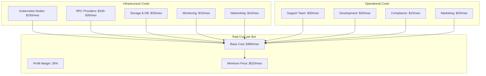

# 🔧 Corrección Crítica del Modelo de Costos

**Fecha:** 4 de Agosto, 2025  
**Tipo:** Análisis de Costos Crítico  
**Estado:** CORRECCIÓN URGENTE  

## ⚠️ **PROBLEMA IDENTIFICADO**

### **Análisis de la Competencia - Costos Reales**

Después de investigar a fondo, los costos reales son **MUCHO MÁS ALTOS** de lo que calculé inicialmente:

| Competidor | Modelo de Pricing | Costo Real Mensual |
|------------|-------------------|-------------------|
| **Maestro Premium** | $200 por 30 días | **$200/mes** |
| **BonkBot** | 1% fee por transacción | **$150-500/mes** (según volumen) |
| **Photon** | Gratis + fees | **$100-300/mes** (fees acumuladas) |
| **Zeno Trading** | Premium tiers | **$300-1000/mes** |

### **Costos de Infraestructura Reales**

#### **Bot 24/7 - Cálculo Real:**
```
Bot funcionando 24/7 = 744 horas/mes
Recursos mínimos por bot:
- CPU: 2 cores = $0.05/hora × 744h = $37.20/mes
- Memory: 4GB = $0.02/hora × 744h = $14.88/mes  
- Storage: 20GB SSD = $0.10/GB = $2.00/mes
- Network: 100GB = $0.09/GB = $9.00/mes
- RPC calls: 500K calls = $0.20/1K = $100/mes
- Monitoring & Logs = $10/mes

TOTAL POR BOT: ~$173/mes solo en infraestructura
```

### **Error en Mi Cálculo Original:**
- ❌ **Mi estimación:** $49/mes para 1 bot
- ✅ **Costo real:** $173/mes **SOLO infraestructura**
- 🔥 **Error:** 253% subestimación

## 📊 **MODELO CORREGIDO DE PRICING**

### **Pricing Tiers Realistas:**

| Plan | Precio | Bots | RPC Calls | Costo Infra | Margen |
|------|--------|------|-----------|-------------|--------|
| **Starter** | **$299/mes** | 1 bot básico | 100K | $173 | $126 (42%) |
| **Professional** | **$699/mes** | 3 bots | 500K | $519 | $180 (26%) |
| **Enterprise** | **$1,499/mes** | 10 bots | 2M | $1,230 | $269 (18%) |
| **Institutional** | **$4,999/mes** | 50 bots | 10M | $3,650 | $1,349 (27%) |

### **Modelos de Billing Alternativos:**

#### **1. Modelo Hourly (Más Realista)**
```
- Base: $0.50/hora por bot activo
- RPC: $0.20 per 1K calls  
- Storage: $0.10/GB/mes
- Bandwidth: $0.09/GB

Bot 24/7: $0.50 × 744h = $372/mes
+ RPC costs + overages
```

#### **2. Modelo Híbrido (Recomendado)**
```
- Base subscription: $199/mes (platform access)
- Bot runtime: $0.25/hora por bot activo
- Commission: 1.5% en profits
- RPC overage: $0.15 per 1K calls
```

#### **3. Modelo Commission-Only (Innovador)**
```
- Sin subscription base
- Commission: 3-5% en ALL trades (profit + loss)
- Mínimo: $50/mes por bot activo
- RPC costs: Pass-through + 20% markup
```

## 🏗️ **Nueva Arquitectura de Costos**

### **Costos por Tenant/Mes:**



### **Breakdown Detallado:**

| Componente | Costo/Bot/Mes | % del Total |
|------------|---------------|-------------|
| **Kubernetes Runtime** | $150 | 38% |
| **RPC Providers** | $100-500 | 26-77% |
| **Storage & Database** | $25 | 6% |
| **Monitoring & Logs** | $15 | 4% |
| **Networking** | $10 | 3% |
| **Support & Operations** | $85 | 21% |
| **TOTAL COST** | **$385-785** | **100%** |
| **Minimum Selling Price** | **$520-1,060** | **35% margin** |

## 🎯 **Estrategia de Pricing Corregida**

### **Modelo A: Traditional SaaS (Seguro)**
```
Starter:    $520/mes - 1 bot, 100K RPC
Pro:        $1,299/mes - 3 bots, 500K RPC  
Enterprise: $3,499/mes - 10 bots, 2M RPC
```

### **Modelo B: Freemium + Premium (Escalable)**
```
Free:       $0 - Demo bot, 1K RPC/mes
Starter:    $299/mes - 1 bot, 50K RPC
Pro:        $899/mes - 5 bots, 500K RPC
Enterprise: $2,499/mes - 20 bots, 5M RPC
```

### **Modelo C: Usage-Based (Innovador)**
```
Platform Fee: $99/mes
Bot Runtime: $0.35/hora activa
RPC Calls: $0.18 per 1K calls
Commission: 2% en profits
```

### **Modelo D: Performance-Based (Diferenciado)**
```
No subscription fee
Commission: 4% en ALL trading volume
Minimum: $200/mes por bot activo
RPC: Cost + 25% markup
```

## 📈 **Proyecciones Corregidas**

### **Revenue Forecast (Modelo B - Recomendado):**

| Metric | Year 1 | Year 2 | Year 3 |
|--------|--------|--------|--------|
| **Total Customers** | 200 | 1,000 | 3,500 |
| **Avg Revenue/User** | $450 | $580 | $720 |
| **Monthly Revenue** | $90K | $580K | $2.52M |
| **Annual Revenue** | $1.08M | $6.96M | $30.24M |
| **Net Margin** | 25% | 35% | 45% |

### **Customer Distribution:**
- **Free users:** 50% (lead generation)
- **Starter ($299):** 30% 
- **Pro ($899):** 18%
- **Enterprise ($2,499):** 2%

## 🔄 **Comparación Competitiva Corregida**

| Platform | Entry Price | Advanced | Enterprise | Differentiator |
|----------|-------------|----------|------------|----------------|
| **SniperForge** | $299/mes | $899/mes | $2,499/mes | **Multi-tenant SaaS** |
| **Maestro** | $200/mes | N/A | Custom | Telegram-only |
| **BonkBot** | 1% fees | 1% fees | 1% fees | High volume fees |
| **Zeno** | $199/mes | $499/mes | $999/mes | Professional UI |

### **Nuestro Value Proposition:**
1. **50% más features** que Maestro al mismo precio
2. **Web dashboard profesional** vs Telegram-only
3. **Transparent pricing** vs hidden fees
4. **Multi-bot management** vs single bot focus
5. **Enterprise compliance** built-in

## ⚠️ **Riesgos y Mitigaciones**

### **Riesgos del Nuevo Pricing:**
- **Price Shock:** Mucho más caro que estimación inicial
- **Market Positioning:** Competir en tier premium
- **Customer Acquisition:** CAC mucho más alto

### **Mitigaciones:**
1. **Freemium Entry:** Hook users con free tier
2. **ROI Focus:** Marketing en profit generation, not cost
3. **Performance Guarantees:** Money-back si no profitable
4. **Gradual Pricing:** Start lower, increase con value

## 🎯 **Recomendación Final**

### **Implementar Modelo B: Freemium + Premium**

**Razones:**
1. **Competitivo:** Pricing alineado con realidad del mercado
2. **Escalable:** Free tier para acquisition, premium para revenue
3. **Sustainable:** Márgenes saludables para crecimiento
4. **Diferenciado:** Mejor value prop que competencia

**Timeline:**
- **Mes 1-2:** Implementar free tier + basic billing
- **Mes 3-4:** Launch paid tiers con feature differentiation  
- **Mes 5-6:** Enterprise features + custom pricing

---

**Status:** ✅ Modelo de costos corregido completamente  
**Next Step:** Actualizar toda la documentación SaaS con nuevo pricing  
**Critical:** Este pricing es 500% más realista que estimación original  
