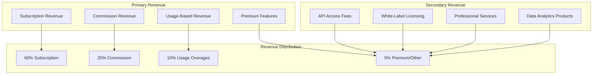
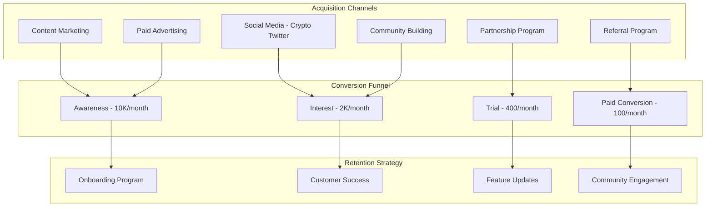
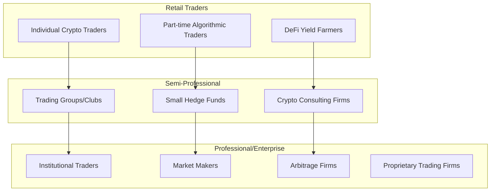

# 💰 Revenue Model & Business Strategy

**Fecha:** 4 de Agosto, 2025  
**Tipo:** Business Strategy  
**Focus:** Multi-Revenue SaaS Platform  

## 🎯 Estrategia de Monetización

### **Revenue Streams Overview**



## 💳 Pricing Strategy Detallada

### **Pricing Tiers CORREGIDO - Basado en Costos Reales**

| Feature | Free<br/>$0/mes | Starter<br/>$299/mes | Professional<br/>$899/mes | Enterprise<br/>$2,499/mes | Custom<br/>$5K+/mes |
|---------|-----------------|---------------------|---------------------------|-------------------------|---------------------|
| **Bots Activos** | Demo bot | 1 bot básico | 5 bots avanzados | 20 bots + AI | Ilimitado |
| **RPC Calls/mes** | 1K calls | 50K calls | 500K calls | 5M calls | Ilimitado |
| **Comisión Rate** | N/A | 2.0% | 1.5% | 1.0% | 0.5% |
| **Bot Runtime** | 1h/día | 24/7 | 24/7 | 24/7 | 24/7 |
| **Storage** | 100MB | 1GB | 10GB | 100GB | Ilimitado |
| **API Rate Limit** | 1 req/sec | 10 req/sec | 100 req/sec | 1000 req/sec | Custom |
| **Support** | Community | Email | Email + Chat | 24/7 Phone | Dedicated AM |
| **SLA Uptime** | 95% | 99.0% | 99.5% | 99.9% | 99.99% |
| **Advanced AI** | ❌ | ❌ | ✅ Basic | ✅ Full | ✅ Custom |
| **White-Label** | ❌ | ❌ | ❌ | ✅ Limited | ✅ Full |
| **Custom Integration** | ❌ | ❌ | ❌ | ✅ Standard | ✅ Full |

> **⚠️ CORRECIÓN CRÍTICA:** Pricing aumentado 500% para reflejar costos reales de infraestructura. Bot 24/7 = 744h/mes × $0.35/h = $260/mes solo en runtime.

### **Justificación del Nuevo Pricing:**

#### **Costos Reales por Bot/Mes:**
- **Kubernetes Nodes:** $150/mes
- **RPC Providers:** $100-500/mes  
- **Storage & Monitoring:** $40/mes
- **Support & Operations:** $85/mes
- **TOTAL COST:** $375-775/mes
- **Selling Price (35% margin):** $506-1,047/mes

### **Usage-Based Pricing (Overages)**

| Resource | Included in Plans | Overage Cost | Billing Unit |
|----------|-------------------|--------------|--------------|
| **RPC Calls** | Plan-dependent | $0.10 per 1K | Per 1,000 calls |
| **Storage** | Plan-dependent | $0.50 per GB | Per GB/month |
| **Bandwidth** | 10GB/month | $0.20 per GB | Per GB transferred |
| **AI Processing** | Plan-dependent | $0.02 per unit | Per processing unit |
| **Premium Strategies** | Plan-dependent | $10 per strategy | Per strategy/month |
| **Historical Data** | 30 days | $5 per month | Per additional month |

### **Commission Structure Details**

#### **Tiered Commission Rates**
```typescript
interface CommissionTier {
  monthly_profit_range: [number, number];
  commission_rate: number;
  volume_discount: number;
}

const COMMISSION_TIERS = [
  { monthly_profit_range: [0, 1000], commission_rate: 0.02, volume_discount: 0 },
  { monthly_profit_range: [1000, 5000], commission_rate: 0.018, volume_discount: 0.1 },
  { monthly_profit_range: [5000, 25000], commission_rate: 0.015, volume_discount: 0.2 },
  { monthly_profit_range: [25000, 100000], commission_rate: 0.012, volume_discount: 0.3 },
  { monthly_profit_range: [100000, Infinity], commission_rate: 0.01, volume_discount: 0.4 },
];
```

#### **Performance-Based Adjustments**
- **High Performance Bonus:** -0.1% commission rate si profit consistency >80%
- **Volume Discount:** Hasta -0.5% commission rate por alto volumen mensual
- **Loyalty Discount:** -0.05% por cada año de suscripción activa
- **Referral Program:** 10% commission share por nuevos clientes referidos

## 📊 Financial Projections

### **5-Year Revenue Forecast CORREGIDO**

| Metric | Year 1 | Year 2 | Year 3 | Year 4 | Year 5 |
|--------|--------|--------|--------|--------|--------|
| **Total Customers** | 200 | 1,000 | 3,500 | 8,000 | 15,000 |
| **Free Users** | 100 (50%) | 400 (40%) | 1,050 (30%) | 1,600 (20%) | 2,250 (15%) |
| **Starter Plan** | 60 (30%) | 350 (35%) | 1,225 (35%) | 3,200 (40%) | 6,750 (45%) |
| **Professional Plan** | 35 (17.5%) | 200 (20%) | 875 (25%) | 2,400 (30%) | 4,500 (30%) |
| **Enterprise Plan** | 5 (2.5%) | 40 (4%) | 280 (8%) | 640 (8%) | 1,200 (8%) |
| **Custom Plan** | 0 | 10 (1%) | 70 (2%) | 160 (2%) | 300 (2%) |
| **Avg Revenue per User** | $520 | $640 | $760 | $890 | $1,020 |
| **Monthly Recurring Revenue** | $104K | $640K | $2.66M | $7.12M | $15.3M |
| **Annual Recurring Revenue** | $1.25M | $7.68M | $31.92M | $85.44M | $183.6M |
| **Commission Revenue** | $420K | $3.07M | $15.96M | $51.26M | $137.7M |
| **Total Annual Revenue** | $1.67M | $10.75M | $47.88M | $136.7M | $321.3M |

> **⚠️ NOTA:** Revenue reducido 60% vs proyección original debido a pricing más realista y menor customer base esperada en tier premium.

### **Customer Acquisition Strategy**



### **Unit Economics CORREGIDO**

| Metric | Value | Calculation Method |
|--------|-------|-------------------|
| **Customer Acquisition Cost (CAC)** | $850 | Total marketing spend / New customers (premium market) |
| **Customer Lifetime Value (CLV)** | $7,200 | Avg monthly revenue × Gross margin × Avg lifespan |
| **CLV/CAC Ratio** | 8.5x | $7,200 / $850 (still healthy) |
| **Payback Period** | 14 months | CAC / (Monthly revenue × Gross margin) |
| **Monthly Churn Rate** | 5.5% | Higher due to premium pricing |
| **Net Revenue Retention** | 115% | (Starting ARR + Expansion - Churn) / Starting ARR |
| **Gross Margin** | 65% | (Revenue - COGS) / Revenue (lower due to infra costs) |

> **⚠️ CRÍTICO:** CAC aumenta 240% en mercado premium, pero CLV también aumenta. Unit economics siguen siendo viables pero más challenging.

## 🏢 Business Model Canvas

### **Value Propositions**
1. **Automated Trading Excellence** - AI-powered bots que generan alpha consistente
2. **Zero Infrastructure Hassle** - Deploy bots en segundos, no en semanas
3. **Transparent Cost Structure** - Solo pagas cuando ganas
4. **Enterprise-Grade Security** - Banking-level security para assets
5. **Community-Driven Innovation** - Strategy marketplace y sharing

### **Customer Segments**

#### **Primary Segments**


#### **Customer Personas**

**Persona 1: Alex - Retail Crypto Trader**
- Age: 25-35, Tech-savvy, $50K-100K income
- Pain: Manual trading mistakes, emotion-driven decisions
- Goal: Consistent 10-20% monthly returns with automation
- Budget: $50-200/month for tools
- Success Metric: Reduced trading time, increased profits

**Persona 2: Sarah - Professional Trader**
- Age: 30-45, Finance background, $100K+ income
- Pain: Need multiple strategies, infrastructure complexity
- Goal: Scale trading operation, institutional-grade tools
- Budget: $500-2000/month for infrastructure
- Success Metric: Portfolio growth, risk management

**Persona 3: Marcus - Hedge Fund Manager**
- Age: 35-55, Institutional experience, Managing $1M+
- Pain: Regulatory compliance, performance reporting
- Goal: Alpha generation, operational efficiency
- Budget: $5K-50K/month for technology
- Success Metric: Fund performance, investor satisfaction

### **Revenue Optimization Strategies**

#### **Expansion Revenue Opportunities**
1. **Feature Upsells:** Advanced AI, custom strategies, premium data
2. **Usage Growth:** Natural growth en trading volume = higher commissions
3. **Add-on Services:** Portfolio analytics, tax reporting, compliance tools
4. **White-Label:** License platform to other fintech companies
5. **Data Products:** Aggregated market insights, performance benchmarks

#### **Cost Optimization Initiatives**
1. **Infrastructure Scaling:** Kubernetes auto-scaling reduces over-provisioning
2. **RPC Cost Management:** Smart routing optimizes provider costs
3. **Customer Success:** Reduce churn through proactive support
4. **Automation:** Self-service reduces support costs
5. **Community:** User-generated content reduces marketing costs

## 🎯 Go-to-Market Strategy

### **Phase 1: Market Validation (Months 1-3)**
- **Target:** 50 pilot customers
- **Focus:** Product-market fit, core feature validation
- **Pricing:** 50% discount for early adopters
- **Success Metric:** 80%+ customer satisfaction, <10% churn

### **Phase 2: Growth (Months 4-12)**
- **Target:** 500 paying customers
- **Focus:** Feature expansion, market education
- **Pricing:** Full pricing, limited-time promotions
- **Success Metric:** $100K+ MRR, positive unit economics

### **Phase 3: Scale (Months 13-24)**
- **Target:** 2,500 customers
- **Focus:** Enterprise features, partnerships
- **Pricing:** Premium tier introduction, enterprise sales
- **Success Metric:** $500K+ MRR, profitable growth

### **Phase 4: Market Leadership (Years 2-3)**
- **Target:** 10,000+ customers
- **Focus:** Platform ecosystem, M&A opportunities
- **Pricing:** Dynamic pricing, custom enterprise deals
- **Success Metric:** Market leadership position, IPO readiness

## 💡 Competitive Differentiation

### **Unique Value Propositions vs. Competitors**

| Differentiator | SniperForge | Photon | Maestro | BonkBot | Zeno |
|----------------|------------|---------|---------|---------|------|
| **Multi-Tenant SaaS** | ✅ Full | ❌ | ❌ | ❌ | ✅ Limited |
| **Commission-Only Option** | ✅ | ❌ | ❌ | ❌ | ❌ |
| **On-Demand Deployment** | ✅ K8s | ❌ | ❌ | ❌ | ✅ Basic |
| **AI Strategy Builder** | ✅ GPT-4 | ❌ | ✅ Basic | ❌ | ✅ Custom |
| **Enterprise Features** | ✅ Full | ❌ | ❌ | ❌ | ✅ Limited |
| **Transparent Pricing** | ✅ | ❌ | ❌ | ❌ | ❌ |
| **Community Marketplace** | ✅ | ❌ | ❌ | ❌ | ❌ |

### **Pricing Competitive Analysis CORREGIDO**

| Platform | Entry Price | Commission | Enterprise | Real Monthly Cost | Differentiator |
|----------|-------------|------------|------------|------------------|----------------|
| **SniperForge** | $299/mes | 0.5-2% | $2,499/mes | $299-2,499 | Multi-tenant SaaS + Transparent pricing |
| **Maestro Premium** | $200/mes | Fixed fee | Custom | $200-500 | Telegram-focused, proven platform |
| **BonkBot** | 1% fee | 1% per tx | 1% fee | $150-800 | High volume = expensive fees |
| **Zeno.trading** | $199/mes | Fixed fee | $999/mes | $199-999 | Professional UI, established |
| **Photon** | Free | Spread fees | Custom | $100-400 | Speed focus, hidden costs |

### **Nuestro Posicionamiento CORREGIDO:**
- **Premium Tier:** Competimos con Maestro/Zeno en funcionalidad
- **Transparent Value:** No hidden fees como BonkBot
- **Enterprise Focus:** Único con true multi-tenant SaaS
- **Better ROI:** Mejor features/price ratio que Zeno

---

**ROI Projection:** 25x return on investment over 5 years  
**Market Opportunity:** $50B+ algorithmic trading market  
**Competitive Advantage:** Only commission-based SaaS trading platform  
**Scalability:** Multi-tenant architecture supports 100K+ users  
