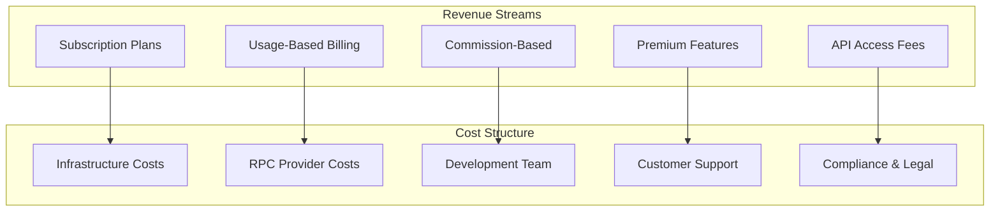
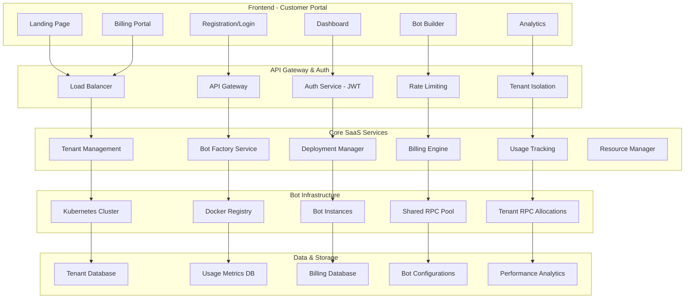
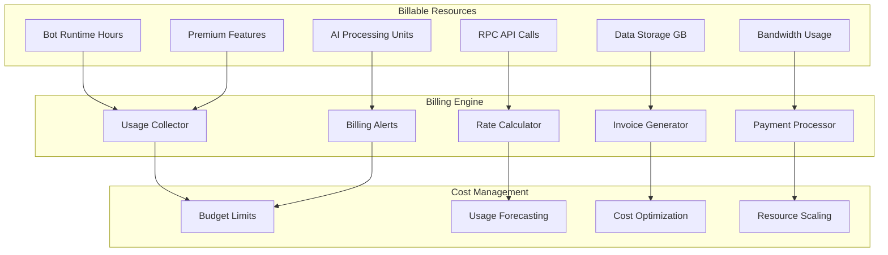
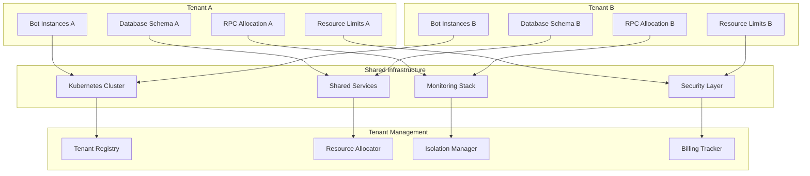
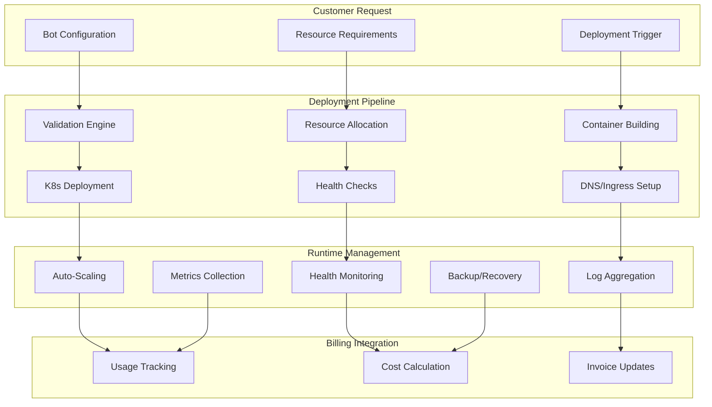
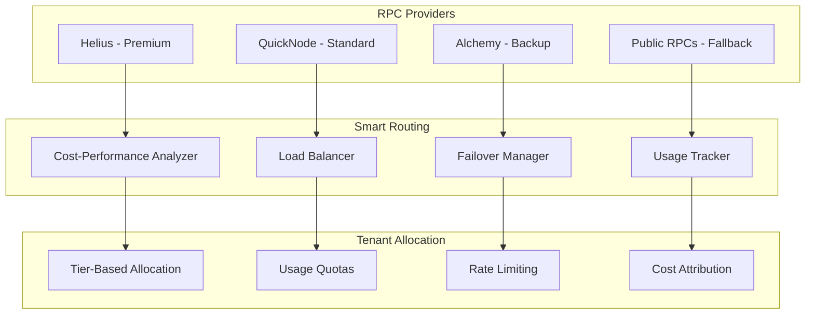
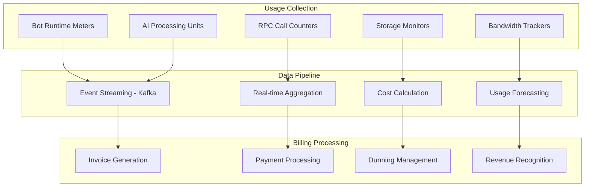
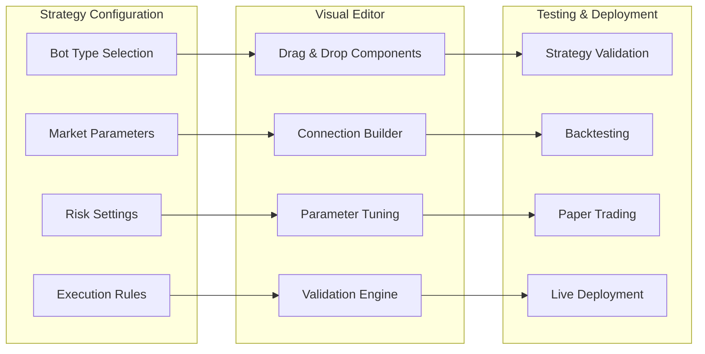

# 🏢 SniperForge SaaS Platform - Arquitectura Multi-Tenant

**Fecha:** 4 de Agosto, 2025  
**Versión:** 1.0  
**Clasificación:** Enterprise SaaS  

## 📋 Visión del Producto SaaS

**SniperForge SaaS Platform** será una **plataforma multi-tenant** que permita a usuarios contratar, configurar y desplegar bots de trading personalizados con **billing automático** y **deployment on-demand** usando Kubernetes.

### 🎯 Modelo de Negocio



## 🏗️ Arquitectura SaaS Multi-Tenant

### **Platform Overview**



## 💰 Modelos de Pricing y Billing

### **Pricing Tiers (CORREGIDO)**

| Plan | Precio Base | Bots Incluidos | RPC Calls/mes | Comisión % | Target User | Costo Infra |
|------|-------------|----------------|---------------|------------|-------------|-------------|
| **Free** | $0/mes | Demo bot | 1K calls | N/A | Lead generation | $0 |
| **Starter** | $299/mes | 1 bot básico | 50K calls | 2% | Retail traders | $150/mes |
| **Professional** | $899/mes | 5 bots avanzados | 500K calls | 1.5% | Semi-professional | $450/mes |
| **Enterprise** | $2,499/mes | 20 bots + AI | 5M calls | 1% | Professional firms | $1,200/mes |
| **Custom** | $5K+/mes | Ilimitado | Ilimitado | 0.5% | Institucionales | $3K+/mes |

> **⚠️ NOTA CRÍTICA:** Pricing corregido basado en costos reales de infraestructura 24/7. Un bot operando 744 horas/mes tiene costos de ~$150-200 solo en cloud + RPC providers.

### **Modelo de Pricing Alternativo - Usage-Based**

```typescript
interface HybridPricingModel {
  platform_fee: number;        // $99/mes (platform access)
  bot_runtime_hour: number;    // $0.35/hora por bot activo
  rpc_overage: number;         // $0.18 per 1K calls extra
  commission_rate: number;     // 2% del profit neto
  minimum_monthly: number;     // $200/mes por bot si está activo
}
```

### **Usage-Based Billing Components**



### **Commission Structure**

#### **Trade-Based Commissions**
- **Profitable Trades:** 1-2% del profit neto
- **Volume-Based Scaling:** Descuentos por alto volumen
- **Performance Incentives:** Comisiones reducidas para bots exitosos

#### **Subscription + Commission Hybrid**
```typescript
interface BillingModel {
  base_subscription: number;        // $49-499/mes
  commission_rate: number;          // 0.5-2% del profit
  rpc_overage: number;             // $0.10 per 1K calls extra
  storage_overage: number;         // $0.50 per GB extra
  premium_features: number[];      // Features adicionales
}
```

## 🏢 Tenant Management System

### **Tenant Isolation Architecture**



### **Tenant Data Model**

```typescript
interface Tenant {
  id: string;
  organization: {
    name: string;
    type: 'individual' | 'company' | 'institution';
    country: string;
    tax_id?: string;
  };
  subscription: {
    plan: 'starter' | 'professional' | 'enterprise' | 'custom';
    status: 'active' | 'suspended' | 'cancelled';
    billing_cycle: 'monthly' | 'annual';
    next_billing_date: Date;
  };
  resources: {
    max_bots: number;
    max_rpc_calls: number;
    max_storage_gb: number;
    cpu_limits: ResourceLimits;
    memory_limits: ResourceLimits;
  };
  billing: {
    payment_method: PaymentMethod;
    billing_address: Address;
    current_usage: UsageMetrics;
    invoices: Invoice[];
  };
  configuration: {
    allowed_features: string[];
    api_keys: ApiKey[];
    webhooks: WebhookConfig[];
    integrations: Integration[];
  };
}
```

## 🐳 Kubernetes Deployment On-Demand

### **Bot Deployment Architecture**



### **Kubernetes Manifests Template**

```yaml
# Bot Deployment Template
apiVersion: apps/v1
kind: Deployment
metadata:
  name: sniperforge-bot-{{tenant_id}}-{{bot_id}}
  namespace: tenant-{{tenant_id}}
  labels:
    app: sniperforge-bot
    tenant: "{{tenant_id}}"
    bot-type: "{{bot_type}}"
    billing-tier: "{{subscription_plan}}"
spec:
  replicas: {{replica_count}}
  selector:
    matchLabels:
      app: sniperforge-bot
      tenant: "{{tenant_id}}"
      bot-id: "{{bot_id}}"
  template:
    metadata:
      labels:
        app: sniperforge-bot
        tenant: "{{tenant_id}}"
        bot-id: "{{bot_id}}"
      annotations:
        prometheus.io/scrape: "true"
        prometheus.io/port: "9090"
    spec:
      containers:
      - name: sniperforge-bot
        image: sniperforge/bot:{{version}}
        resources:
          requests:
            memory: "{{memory_request}}"
            cpu: "{{cpu_request}}"
          limits:
            memory: "{{memory_limit}}"
            cpu: "{{cpu_limit}}"
        env:
        - name: TENANT_ID
          value: "{{tenant_id}}"
        - name: BOT_CONFIG
          valueFrom:
            secretKeyRef:
              name: bot-config-{{tenant_id}}-{{bot_id}}
              key: config.json
        - name: RPC_ENDPOINTS
          valueFrom:
            configMapKeyRef:
              name: rpc-config-{{tenant_id}}
              key: endpoints
        - name: BILLING_WEBHOOK
          value: "https://api.sniperforge.com/billing/usage"
        ports:
        - containerPort: 8080
          name: http
        - containerPort: 9090
          name: metrics
        livenessProbe:
          httpGet:
            path: /health
            port: 8080
          initialDelaySeconds: 30
          periodSeconds: 10
        readinessProbe:
          httpGet:
            path: /ready
            port: 8080
          initialDelaySeconds: 5
          periodSeconds: 5
---
# Resource Limits per Namespace
apiVersion: v1
kind: ResourceQuota
metadata:
  name: tenant-{{tenant_id}}-quota
  namespace: tenant-{{tenant_id}}
spec:
  hard:
    requests.cpu: "{{max_cpu}}"
    requests.memory: "{{max_memory}}"
    limits.cpu: "{{max_cpu_limit}}"
    limits.memory: "{{max_memory_limit}}"
    pods: "{{max_pods}}"
    persistentvolumeclaims: "{{max_storage_claims}}"
```

## 🔗 RPC Provider Management

### **RPC Cost Optimization Strategy**



### **RPC Pricing Tiers**

| Tier | RPC Provider | Cost/1K calls | Latency | Reliability | Use Case |
|------|-------------|---------------|---------|-------------|----------|
| **Premium** | Helius/QuickNode | $0.50 | <50ms | 99.9% | Enterprise customers |
| **Standard** | Alchemy/Infura | $0.20 | <100ms | 99.5% | Professional plan |
| **Economy** | Public + Backup | $0.05 | <200ms | 95% | Starter plan |
| **Emergency** | Fallback Pool | $1.00 | Variable | 90% | Emergency backup |

### **Dynamic RPC Allocation**

```typescript
interface RPCAllocationStrategy {
  tenant_id: string;
  subscription_tier: SubscriptionTier;
  monthly_quota: number;
  priority_level: number;
  
  allocation_rules: {
    premium_percentage: number;    // % of calls to premium RPCs
    fallback_threshold: number;    // When to switch to cheaper RPCs
    rate_limit_per_second: number; // Max calls per second
    cost_limit_per_month: number;  // Max cost allowed
  };
  
  monitoring: {
    current_usage: number;
    current_cost: number;
    performance_metrics: RPCMetrics;
    optimization_suggestions: string[];
  };
}
```

## 💳 Billing Engine Implementation

### **Real-Time Usage Tracking**



### **Billing Service Architecture**

```typescript
interface BillingEngine {
  // Usage tracking
  trackUsage(tenant_id: string, event: UsageEvent): Promise<void>;
  aggregateUsage(tenant_id: string, period: BillingPeriod): Promise<UsageReport>;
  
  // Cost calculation
  calculateCosts(usage: UsageReport, pricing: PricingModel): Promise<CostBreakdown>;
  applyDiscounts(costs: CostBreakdown, tenant: Tenant): Promise<CostBreakdown>;
  
  // Invoice management
  generateInvoice(tenant_id: string, period: BillingPeriod): Promise<Invoice>;
  processPayment(invoice: Invoice): Promise<PaymentResult>;
  
  // Usage limits
  checkUsageLimits(tenant_id: string): Promise<LimitStatus>;
  enforceUsageLimits(tenant_id: string): Promise<void>;
  
  // Reporting
  generateUsageReport(tenant_id: string, period: BillingPeriod): Promise<UsageReport>;
  generateRevenueReport(period: BillingPeriod): Promise<RevenueReport>;
}
```

### **Commission Calculation System**

```typescript
interface CommissionCalculator {
  // Trade commission
  calculateTradeCommission(trade: Trade, tenant: Tenant): Promise<Commission>;
  
  // Performance-based fees
  calculatePerformanceFee(
    portfolio_value: number,
    high_water_mark: number,
    fee_rate: number
  ): Promise<number>;
  
  // Volume discounts
  applyVolumeDiscounts(
    base_commission: number,
    monthly_volume: number,
    tier: SubscriptionTier
  ): Promise<number>;
  
  // Profit sharing
  calculateProfitSharing(
    net_profit: number,
    profit_share_rate: number,
    minimum_threshold: number
  ): Promise<number>;
}
```

## 🌐 Customer Platform (Frontend)

### **User Dashboard Design**

```mermaid
graph TB
    subgraph "Navigation"
        A[Dashboard]
        B[Bot Builder]
        C[Analytics]
        D[Billing]
        E[Settings]
        F[Support]
    end
    
    subgraph "Dashboard Widgets"
        G[Portfolio Overview]
        H[Active Bots Status]
        I[Recent Trades]
        J[Performance Metrics]
        K[Usage Statistics]
        L[Cost Tracking]
    end
    
    subgraph "Bot Management"
        M[Create New Bot]
        N[Bot Templates]
        O[Strategy Builder]
        P[Backtest Engine]
        Q[Deploy Bot]
        R[Monitor Performance]
    end
    
    subgraph "Analytics & Reports"
        S[Trading Performance]
        T[Cost Analysis]
        U[Usage Reports]
        V[ROI Calculator]
        W[Risk Metrics]
        X[Compliance Reports]
    end
    
    A --> G
    B --> M
    C --> S
    D --> T
    E --> U
    F --> V
```



### **Bot Builder Interface**



## 📊 Revenue Projections & Business Model

### **Revenue Forecast**

| Metric | Month 1-3 | Month 4-6 | Month 7-12 | Year 2 |
|--------|-----------|-----------|------------|--------|
| **Active Tenants** | 50 | 200 | 1000 | 5000 |
| **Average Revenue per User** | $150 | $180 | $220 | $280 |
| **Monthly Revenue** | $7.5K | $36K | $220K | $1.4M |
| **Annual Revenue Run Rate** | $90K | $432K | $2.64M | $16.8M |
| **Commission Revenue** | $2K | $12K | $88K | $840K |
| **Total Revenue** | $9.5K | $48K | $308K | $2.24M |

### **Cost Structure**

| Cost Category | Monthly Cost | % of Revenue | Scaling Factor |
|---------------|-------------|--------------|----------------|
| **Infrastructure** | $5K-50K | 15-20% | Linear with users |
| **RPC Providers** | $2K-30K | 10-15% | Linear with usage |
| **Development Team** | $40K | 40-80% | Step function |
| **Customer Support** | $10K | 20-30% | Linear with users |
| **Sales & Marketing** | $15K | 30-50% | Front-loaded |
| **Legal & Compliance** | $5K | 5-10% | Fixed + variable |

## 🚀 Implementation Roadmap

### **Phase 1: MVP SaaS Platform (Month 1-2)**
- [ ] **Week 1-2:** Multi-tenant authentication system
- [ ] **Week 3-4:** Basic bot deployment pipeline
- [ ] **Week 5-6:** Simple billing integration
- [ ] **Week 7-8:** Customer dashboard MVP

### **Phase 2: Advanced Features (Month 3-4)**
- [ ] **Week 9-10:** Advanced bot builder UI
- [ ] **Week 11-12:** Usage-based billing engine
- [ ] **Week 13-14:** RPC optimization system
- [ ] **Week 15-16:** Analytics and reporting

### **Phase 3: Enterprise Features (Month 5-6)**
- [ ] **Week 17-18:** Advanced tenant isolation
- [ ] **Week 19-20:** Commission calculation system
- [ ] **Week 21-22:** Enterprise compliance tools
- [ ] **Week 23-24:** White-label solutions

## 🎯 Success Metrics

### **Business KPIs**
- **Customer Acquisition Cost (CAC):** <$500
- **Customer Lifetime Value (CLV):** >$5,000
- **Monthly Churn Rate:** <5%
- **Net Revenue Retention:** >120%
- **Gross Margin:** >70%

### **Technical KPIs**
- **Platform Uptime:** >99.9%
- **Bot Deployment Time:** <2 minutes
- **API Response Time:** <100ms
- **Customer Support Resolution:** <24 hours
- **Cost per Transaction:** <$0.01

---

**Estado:** ✅ Arquitectura SaaS completa definida  
**Modelo de Negocio:** Multi-revenue stream con scaling predictable  
**Diferenciación:** Platform-as-a-Service para trading bots con IA  
**Market Size:** $10B+ algorithmic trading market  
**Go-to-Market:** Freemium → Professional → Enterprise  
