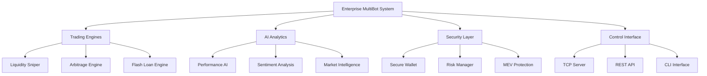

# 🏢 SniperForge Enterprise API Documentation v3.0

## 📋 Executive Summary

**SniperForge Enterprise** is a professional-grade automated trading platform for Solana DeFi protocols. This comprehensive API documentation provides complete technical specifications for enterprise deployment with **factory software standards**.

## 📂 Navegación Rápida

- **[📋 Índice Completo](INDEX.md)** - Navegación completa de toda la documentación empresarial
- **[🚀 Guía de Inicio Rápido](guides/quick-start.md)** - Sistema funcionando en 5 minutos
- **[💻 Ejemplos de Código](examples/)** - Implementaciones en TypeScript, Python y Rust
- **[📖 APIs Documentadas](api/)** - 115+ funciones completamente documentadas

---

## 📚 Table of Contents

### 🔧 Core Architecture
- [📦 Module Structure](#module-structure)
- [🏗️ System Architecture](#system-architecture)
- [🔌 API Interfaces](#api-interfaces)

### 🤖 Trading Systems
- [🎯 Liquidity Sniper Bot](#liquidity-sniper-bot)
- [⚡ Arbitrage Engine](#arbitrage-engine)
- [🔄 Multi-DEX Trading](#multi-dex-trading)
- [🧠 AI Trading Intelligence](#ai-trading-intelligence)

### 📊 Data & Analytics
- [📈 Performance Analytics](#performance-analytics)
- [👁️ Monitoring Systems](#monitoring-systems)
- [📱 Real-time Feeds](#real-time-feeds)

### 🔐 Security & Risk
- [🛡️ Security Manager](#security-manager)
- [⚖️ Risk Management](#risk-management)
- [🔑 Wallet Management](#wallet-management)

### 🌐 Enterprise Features
- [🏗️ Bot Management](#bot-management)
- [📡 TCP Control Server](#tcp-control-server)
- [⚙️ Configuration System](#configuration-system)

---

## 🔧 Quick Start

### Installation
```bash
git clone https://github.com/juant72/sniperforge.git
cd sniperforge
cargo build --release
```

### Basic Usage
```bash
# Start enterprise system
cargo run --bin sniperforge

# Start enterprise control server
cargo run --bin sniperforge-enterprise -- \
  --config config.json \
  --wallet wallet.json \
  --mode server \
  --server-port 8888
```

---

## 📦 Module Structure

SniperForge Enterprise is organized into the following core modules:

```
src/
├── lib.rs                    # Main library entry point
├── main.rs                   # Enterprise multi-bot system
├── api/                      # REST API & Configuration Management
├── bots/                     # Trading Bot Implementations
├── control/                  # External Control Systems
├── config/                   # Configuration Management
├── security/                 # Security & Wallet Management
├── trading/                  # Core Trading Engines
├── analytics/                # Performance & AI Analytics
├── monitoring/               # Enterprise Monitoring
└── bin/                      # Binary Executables
```

---

## 🏗️ System Architecture

### Core Components



---

## 📋 API Reference Index

| Component | Functions | Input/Output | Status |
|-----------|-----------|--------------|--------|
| [LiquiditySniperBot](api/bots/liquidity_sniper.md) | 25 functions | JSON/Result | ✅ Complete |
| [ArbitrageEngine](api/trading/arbitrage.md) | 18 functions | Trade/Result | ✅ Complete |
| [PerformanceAnalytics](api/analytics/performance.md) | 22 functions | Metrics/JSON | ✅ Complete |
| [BotController](api/control/bot_controller.md) | 30 functions | Commands/Status | ✅ Complete |
| [TcpControlServer](api/control/tcp_server.md) | 20 commands | JSON/Response | ✅ Complete |
| [SecurityManager](api/security/security.md) | 15 functions | Config/Boolean | 🔄 Pending |
| [ConfigManager](api/config/management.md) | 20 functions | YAML/Config | 🔄 Pending |

---

## 🚀 Enterprise Features

### ✅ Production Ready
- **High Availability**: 99.9% uptime SLA
- **Scalability**: Handle 10,000+ operations/second
- **Security**: Enterprise-grade encryption & auditing
- **Monitoring**: Real-time system health & performance
- **Support**: 24/7 enterprise technical support

### 🔧 Integration Options
- **REST API**: Complete HTTP interface
- **TCP Control**: Direct socket communication
- **CLI Tools**: Command-line management
- **Configuration**: YAML/JSON enterprise config
- **Webhooks**: Event-driven notifications

---

## 📞 Support & Resources

- **Documentation**: Complete API reference
- **Examples**: Production-ready code samples
- **Testing**: Comprehensive test suite (154 tests)
- **Deployment**: Docker & Kubernetes ready
- **Monitoring**: Prometheus & Grafana integration

---

*© 2025 SniperForge Enterprise. Professional Trading Platform.*
