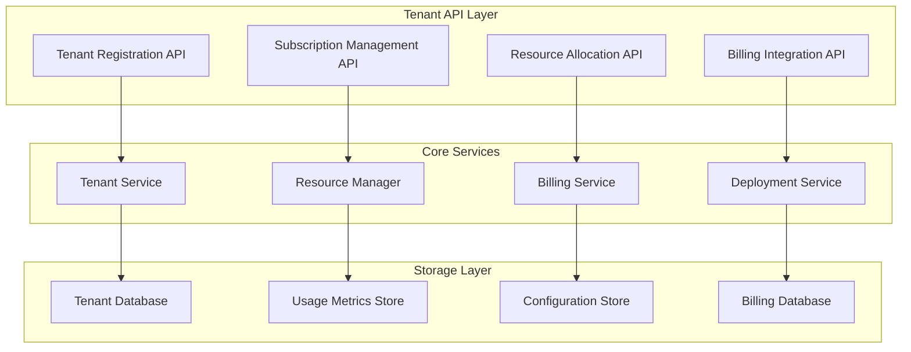

# 🏗️ Technical Implementation - SaaS Multi-Tenant System

**Fecha:** 4 de Agosto, 2025  
**Tipo:** Implementación Técnica  
**Prioridad:** Crítica  

## 🔧 Implementación Detallada del Sistema

### **1. Tenant Management Service**



### **Arquitectura de Código Rust**

```rust
// src/saas/tenant_manager.rs
#[derive(Debug, Clone)]
pub struct TenantManager {
    db: Arc<Database>,
    k8s_client: Arc<K8sClient>,
    billing_engine: Arc<BillingEngine>,
    resource_allocator: Arc<ResourceAllocator>,
    deployment_manager: Arc<DeploymentManager>,
}

impl TenantManager {
    pub async fn create_tenant(&self, registration: TenantRegistration) -> Result<Tenant> {
        // 1. Validate registration data
        self.validate_registration(&registration).await?;
        
        // 2. Create tenant record
        let tenant = self.db.create_tenant(registration).await?;
        
        // 3. Setup Kubernetes namespace
        self.k8s_client.create_namespace(&tenant.id).await?;
        
        // 4. Initialize resource quotas
        self.resource_allocator.setup_quotas(&tenant).await?;
        
        // 5. Setup billing account
        self.billing_engine.create_billing_account(&tenant).await?;
        
        // 6. Deploy initial resources
        self.deployment_manager.deploy_tenant_infrastructure(&tenant).await?;
        
        Ok(tenant)
    }
    
    pub async fn deploy_bot(&self, tenant_id: &str, bot_config: BotConfiguration) -> Result<BotDeployment> {
        // 1. Validate tenant permissions
        let tenant = self.validate_tenant_access(tenant_id).await?;
        
        // 2. Check resource limits
        self.resource_allocator.check_limits(&tenant, &bot_config).await?;
        
        // 3. Generate deployment manifests
        let manifests = self.generate_bot_manifests(&tenant, &bot_config).await?;
        
        // 4. Deploy to Kubernetes
        let deployment = self.k8s_client.deploy_bot(&tenant.id, manifests).await?;
        
        // 5. Setup monitoring and billing
        self.setup_bot_monitoring(&tenant, &deployment).await?;
        
        // 6. Start usage tracking
        self.billing_engine.start_usage_tracking(&tenant.id, &deployment.id).await?;
        
        Ok(deployment)
    }
    
    pub async fn scale_bot(&self, tenant_id: &str, bot_id: &str, replicas: i32) -> Result<()> {
        // 1. Validate scaling request
        let tenant = self.validate_tenant_access(tenant_id).await?;
        self.resource_allocator.validate_scaling(&tenant, bot_id, replicas).await?;
        
        // 2. Execute scaling
        self.k8s_client.scale_deployment(&tenant.id, bot_id, replicas).await?;
        
        // 3. Update billing projections
        self.billing_engine.update_scaling_costs(&tenant.id, bot_id, replicas).await?;
        
        Ok(())
    }
}

#[derive(Debug, Serialize, Deserialize)]
pub struct TenantRegistration {
    pub organization_name: String,
    pub admin_email: String,
    pub subscription_plan: SubscriptionPlan,
    pub billing_info: BillingInformation,
    pub initial_configuration: TenantConfiguration,
}

#[derive(Debug, Serialize, Deserialize)]
pub struct Tenant {
    pub id: TenantId,
    pub organization: Organization,
    pub subscription: Subscription,
    pub resources: ResourceLimits,
    pub configuration: TenantConfiguration,
    pub status: TenantStatus,
    pub created_at: DateTime<Utc>,
    pub updated_at: DateTime<Utc>,
}
```

### **2. Billing Engine Implementation**

```rust
// src/saas/billing_engine.rs
#[derive(Debug, Clone)]
pub struct BillingEngine {
    db: Arc<BillingDatabase>,
    payment_processor: Arc<PaymentProcessor>,
    usage_tracker: Arc<UsageTracker>,
    commission_calculator: Arc<CommissionCalculator>,
    invoice_generator: Arc<InvoiceGenerator>,
}

impl BillingEngine {
    pub async fn track_usage(&self, tenant_id: &str, usage_event: UsageEvent) -> Result<()> {
        // Real-time usage tracking
        self.usage_tracker.record_event(tenant_id, usage_event.clone()).await?;
        
        // Check usage limits
        let current_usage = self.usage_tracker.get_current_usage(tenant_id).await?;
        let limits = self.get_tenant_limits(tenant_id).await?;
        
        if current_usage.exceeds_limits(&limits) {
            self.enforce_usage_limits(tenant_id, &limits).await?;
        }
        
        // Calculate real-time costs
        let cost = self.calculate_usage_cost(&usage_event).await?;
        self.db.record_usage_cost(tenant_id, cost).await?;
        
        Ok(())
    }
    
    pub async fn process_monthly_billing(&self, tenant_id: &str) -> Result<Invoice> {
        // 1. Aggregate monthly usage
        let usage_report = self.usage_tracker.generate_monthly_report(tenant_id).await?;
        
        // 2. Calculate subscription costs
        let subscription_cost = self.calculate_subscription_cost(tenant_id).await?;
        
        // 3. Calculate usage-based costs
        let usage_cost = self.calculate_usage_costs(&usage_report).await?;
        
        // 4. Calculate commissions from trades
        let commission_cost = self.commission_calculator.calculate_monthly_commissions(tenant_id).await?;
        
        // 5. Apply discounts and credits
        let total_cost = self.apply_billing_adjustments(
            subscription_cost + usage_cost + commission_cost,
            tenant_id
        ).await?;
        
        // 6. Generate invoice
        let invoice = self.invoice_generator.create_invoice(
            tenant_id,
            total_cost,
            usage_report
        ).await?;
        
        // 7. Process payment
        self.payment_processor.charge_customer(&invoice).await?;
        
        Ok(invoice)
    }
    
    pub async fn calculate_trade_commission(&self, tenant_id: &str, trade: &Trade) -> Result<Decimal> {
        let tenant = self.get_tenant(tenant_id).await?;
        let commission_rate = tenant.subscription.commission_rate;
        
        let commission = match trade.result {
            TradeResult::Profit(profit) => {
                let base_commission = profit * commission_rate;
                
                // Apply volume discounts
                let monthly_volume = self.get_monthly_trade_volume(tenant_id).await?;
                let discount = self.calculate_volume_discount(monthly_volume, &tenant.subscription.plan).await?;
                
                base_commission * (Decimal::ONE - discount)
            },
            TradeResult::Loss(_) => Decimal::ZERO, // No commission on losses
        };
        
        // Record commission
        self.db.record_commission(tenant_id, trade.id.clone(), commission).await?;
        
        Ok(commission)
    }
}

#[derive(Debug, Serialize, Deserialize)]
pub struct UsageEvent {
    pub event_type: UsageEventType,
    pub timestamp: DateTime<Utc>,
    pub bot_id: String,
    pub resource_consumed: ResourceConsumption,
    pub cost_impact: CostImpact,
}

#[derive(Debug, Serialize, Deserialize)]
pub enum UsageEventType {
    BotRuntimeHour,
    RPCCall { provider: String, call_type: String },
    StorageUsage { gb_hours: f64 },
    BandwidthUsage { gb_transferred: f64 },
    AIProcessing { processing_units: i32 },
    PremiumFeature { feature_name: String },
}
```

### **3. Kubernetes Deployment Manager**

```rust
// src/saas/deployment_manager.rs
#[derive(Debug, Clone)]
pub struct DeploymentManager {
    k8s_client: Arc<K8sClient>,
    template_engine: Arc<TemplateEngine>,
    resource_calculator: Arc<ResourceCalculator>,
    monitoring_setup: Arc<MonitoringSetup>,
}

impl DeploymentManager {
    pub async fn deploy_bot(&self, tenant: &Tenant, bot_config: &BotConfiguration) -> Result<BotDeployment> {
        // 1. Calculate resource requirements
        let resources = self.resource_calculator.calculate_requirements(bot_config).await?;
        
        // 2. Generate Kubernetes manifests
        let manifests = self.generate_manifests(tenant, bot_config, &resources).await?;
        
        // 3. Apply manifests to cluster
        let deployment_result = self.k8s_client.apply_manifests(&tenant.namespace(), manifests).await?;
        
        // 4. Setup monitoring and logging
        self.monitoring_setup.configure_bot_monitoring(tenant, &deployment_result).await?;
        
        // 5. Setup networking and ingress
        self.setup_bot_networking(tenant, &deployment_result).await?;
        
        // 6. Create backup and recovery configuration
        self.setup_backup_config(tenant, &deployment_result).await?;
        
        Ok(deployment_result)
    }
    
    async fn generate_manifests(
        &self,
        tenant: &Tenant,
        bot_config: &BotConfiguration,
        resources: &ResourceRequirements,
    ) -> Result<Vec<K8sManifest>> {
        let mut manifests = Vec::new();
        
        // Deployment manifest
        let deployment = self.template_engine.render_template(
            "bot-deployment.yaml.j2",
            &DeploymentTemplateData {
                tenant_id: tenant.id.clone(),
                bot_id: bot_config.id.clone(),
                bot_type: bot_config.bot_type.clone(),
                image: format!("sniperforge/bot:{}", bot_config.version),
                resources: resources.clone(),
                environment: self.build_environment_variables(tenant, bot_config).await?,
                labels: self.build_labels(tenant, bot_config),
                annotations: self.build_annotations(tenant, bot_config),
            }
        )?;
        manifests.push(deployment);
        
        // Service manifest
        let service = self.template_engine.render_template(
            "bot-service.yaml.j2",
            &ServiceTemplateData {
                tenant_id: tenant.id.clone(),
                bot_id: bot_config.id.clone(),
                ports: bot_config.exposed_ports.clone(),
                selector: self.build_selector_labels(tenant, bot_config),
            }
        )?;
        manifests.push(service);
        
        // ConfigMap for bot configuration
        let config_map = self.template_engine.render_template(
            "bot-configmap.yaml.j2",
            &ConfigMapTemplateData {
                tenant_id: tenant.id.clone(),
                bot_id: bot_config.id.clone(),
                configuration: serde_json::to_string(&bot_config.runtime_config)?,
                rpc_endpoints: self.get_tenant_rpc_config(tenant).await?,
            }
        )?;
        manifests.push(config_map);
        
        // Secret for sensitive data
        let secret = self.template_engine.render_template(
            "bot-secret.yaml.j2",
            &SecretTemplateData {
                tenant_id: tenant.id.clone(),
                bot_id: bot_config.id.clone(),
                api_keys: self.get_encrypted_api_keys(tenant).await?,
                wallet_keys: self.get_encrypted_wallet_keys(tenant, bot_config).await?,
            }
        )?;
        manifests.push(secret);
        
        // HorizontalPodAutoscaler if auto-scaling enabled
        if bot_config.auto_scaling.enabled {
            let hpa = self.template_engine.render_template(
                "bot-hpa.yaml.j2",
                &HPATemplateData {
                    tenant_id: tenant.id.clone(),
                    bot_id: bot_config.id.clone(),
                    min_replicas: bot_config.auto_scaling.min_replicas,
                    max_replicas: bot_config.auto_scaling.max_replicas,
                    target_cpu_utilization: bot_config.auto_scaling.target_cpu,
                    target_memory_utilization: bot_config.auto_scaling.target_memory,
                }
            )?;
            manifests.push(hpa);
        }
        
        Ok(manifests)
    }
}

#[derive(Debug, Serialize, Deserialize)]
pub struct BotConfiguration {
    pub id: String,
    pub name: String,
    pub bot_type: BotType,
    pub version: String,
    pub runtime_config: serde_json::Value,
    pub resource_requirements: ResourceRequirements,
    pub auto_scaling: AutoScalingConfig,
    pub exposed_ports: Vec<Port>,
    pub health_check: HealthCheckConfig,
    pub backup_config: BackupConfig,
}

#[derive(Debug, Serialize, Deserialize)]
pub struct ResourceRequirements {
    pub cpu_request: String,      // "500m"
    pub cpu_limit: String,        // "2000m"
    pub memory_request: String,   // "1Gi"
    pub memory_limit: String,     // "4Gi"
    pub storage_request: String,  // "10Gi"
    pub storage_class: String,    // "fast-ssd"
}
```

### **4. RPC Provider Management**

```rust
// src/saas/rpc_manager.rs
#[derive(Debug, Clone)]
pub struct RPCManager {
    providers: HashMap<ProviderId, RPCProvider>,
    cost_optimizer: Arc<CostOptimizer>,
    load_balancer: Arc<RPCLoadBalancer>,
    usage_tracker: Arc<RPCUsageTracker>,
    tenant_allocator: Arc<TenantRPCAllocator>,
}

impl RPCManager {
    pub async fn allocate_rpc_for_tenant(&self, tenant: &Tenant) -> Result<RPCAllocation> {
        // 1. Determine RPC tier based on subscription
        let rpc_tier = self.determine_rpc_tier(&tenant.subscription).await?;
        
        // 2. Calculate monthly quota
        let monthly_quota = self.calculate_monthly_quota(&tenant.subscription).await?;
        
        // 3. Select optimal RPC providers
        let providers = self.select_providers_for_tier(&rpc_tier).await?;
        
        // 4. Setup load balancing configuration
        let load_balance_config = self.cost_optimizer.optimize_provider_distribution(
            &providers,
            monthly_quota,
            &tenant.performance_requirements
        ).await?;
        
        // 5. Create allocation record
        let allocation = RPCAllocation {
            tenant_id: tenant.id.clone(),
            tier: rpc_tier,
            monthly_quota,
            providers: load_balance_config,
            rate_limits: self.calculate_rate_limits(&tenant.subscription).await?,
            cost_limits: self.calculate_cost_limits(&tenant.subscription).await?,
        };
        
        // 6. Setup monitoring
        self.usage_tracker.setup_tenant_tracking(&allocation).await?;
        
        Ok(allocation)
    }
    
    pub async fn route_rpc_call(&self, tenant_id: &str, request: RPCRequest) -> Result<RPCResponse> {
        // 1. Get tenant allocation
        let allocation = self.tenant_allocator.get_allocation(tenant_id).await?;
        
        // 2. Check rate limits
        self.usage_tracker.check_rate_limits(tenant_id, &request).await?;
        
        // 3. Check cost limits
        let estimated_cost = self.estimate_call_cost(&request, &allocation).await?;
        self.usage_tracker.check_cost_limits(tenant_id, estimated_cost).await?;
        
        // 4. Select optimal provider
        let provider = self.load_balancer.select_provider(&allocation, &request).await?;
        
        // 5. Execute RPC call
        let response = provider.execute_call(request.clone()).await?;
        
        // 6. Track usage and costs
        let actual_cost = self.calculate_actual_cost(&request, &response, &provider).await?;
        self.usage_tracker.record_usage(tenant_id, &request, &response, actual_cost).await?;
        
        Ok(response)
    }
    
    async fn determine_rpc_tier(&self, subscription: &Subscription) -> Result<RPCTier> {
        match subscription.plan {
            SubscriptionPlan::Starter => Ok(RPCTier::Economy),
            SubscriptionPlan::Professional => Ok(RPCTier::Standard),
            SubscriptionPlan::Enterprise => Ok(RPCTier::Premium),
            SubscriptionPlan::Custom => {
                // Custom tiers based on specific requirements
                if subscription.sla_requirements.latency_ms < 50 {
                    Ok(RPCTier::Premium)
                } else if subscription.sla_requirements.latency_ms < 100 {
                    Ok(RPCTier::Standard)
                } else {
                    Ok(RPCTier::Economy)
                }
            }
        }
    }
}

#[derive(Debug, Serialize, Deserialize)]
pub struct RPCAllocation {
    pub tenant_id: TenantId,
    pub tier: RPCTier,
    pub monthly_quota: u64,
    pub providers: Vec<ProviderAllocation>,
    pub rate_limits: RateLimits,
    pub cost_limits: CostLimits,
}

#[derive(Debug, Serialize, Deserialize)]
pub struct ProviderAllocation {
    pub provider_id: ProviderId,
    pub weight: f64,              // Load balancing weight (0.0-1.0)
    pub priority: u8,             // Failover priority (1=highest)
    pub cost_per_call: Decimal,   // Cost per API call
    pub rate_limit: u32,          // Calls per second limit
    pub endpoints: Vec<String>,   // RPC endpoints
}

#[derive(Debug, Serialize, Deserialize)]
pub enum RPCTier {
    Economy {
        max_latency_ms: u32,      // 200ms
        reliability: f64,         // 95%
        cost_multiplier: f64,     // 1.0x
    },
    Standard {
        max_latency_ms: u32,      // 100ms
        reliability: f64,         // 99.5%
        cost_multiplier: f64,     // 2.0x
    },
    Premium {
        max_latency_ms: u32,      // 50ms
        reliability: f64,         // 99.9%
        cost_multiplier: f64,     // 4.0x
    },
}
```

### **5. Real-Time Usage Tracking**

```rust
// src/saas/usage_tracker.rs
#[derive(Debug, Clone)]
pub struct UsageTracker {
    metrics_store: Arc<MetricsStore>,
    event_stream: Arc<EventStream>,
    aggregator: Arc<UsageAggregator>,
    forecaster: Arc<UsageForecaster>,
}

impl UsageTracker {
    pub async fn track_bot_runtime(&self, tenant_id: &str, bot_id: &str, duration_seconds: u64) -> Result<()> {
        let event = UsageEvent {
            tenant_id: tenant_id.to_string(),
            event_type: UsageEventType::BotRuntime {
                bot_id: bot_id.to_string(),
                duration_seconds,
            },
            timestamp: Utc::now(),
            cost_impact: self.calculate_runtime_cost(tenant_id, duration_seconds).await?,
        };
        
        // Send to real-time stream
        self.event_stream.send(event.clone()).await?;
        
        // Store in metrics database
        self.metrics_store.record_usage(event).await?;
        
        // Update real-time aggregations
        self.aggregator.update_tenant_usage(tenant_id, &event).await?;
        
        Ok(())
    }
    
    pub async fn track_rpc_usage(&self, tenant_id: &str, rpc_call: &RPCCall, cost: Decimal) -> Result<()> {
        let event = UsageEvent {
            tenant_id: tenant_id.to_string(),
            event_type: UsageEventType::RPCCall {
                provider: rpc_call.provider.clone(),
                method: rpc_call.method.clone(),
                response_time_ms: rpc_call.response_time_ms,
                success: rpc_call.success,
            },
            timestamp: Utc::now(),
            cost_impact: CostImpact {
                amount: cost,
                currency: Currency::USD,
                category: CostCategory::RPCUsage,
            },
        };
        
        self.event_stream.send(event.clone()).await?;
        self.metrics_store.record_usage(event).await?;
        self.aggregator.update_tenant_usage(tenant_id, &event).await?;
        
        Ok(())
    }
    
    pub async fn get_real_time_usage(&self, tenant_id: &str) -> Result<RealtimeUsage> {
        // Get current period usage
        let current_usage = self.aggregator.get_current_period_usage(tenant_id).await?;
        
        // Get usage forecast
        let forecast = self.forecaster.forecast_monthly_usage(tenant_id).await?;
        
        // Get cost breakdown
        let cost_breakdown = self.aggregator.get_cost_breakdown(tenant_id).await?;
        
        Ok(RealtimeUsage {
            current_period: current_usage,
            forecast,
            cost_breakdown,
            last_updated: Utc::now(),
        })
    }
    
    pub async fn check_usage_limits(&self, tenant_id: &str) -> Result<UsageLimitStatus> {
        let current_usage = self.aggregator.get_current_period_usage(tenant_id).await?;
        let limits = self.get_tenant_limits(tenant_id).await?;
        
        let status = UsageLimitStatus {
            within_limits: current_usage.is_within_limits(&limits),
            usage_percentage: current_usage.calculate_usage_percentage(&limits),
            warnings: current_usage.generate_warnings(&limits),
            projected_overage: self.forecaster.project_overage(tenant_id, &limits).await?,
        };
        
        Ok(status)
    }
}

#[derive(Debug, Serialize, Deserialize)]
pub struct RealtimeUsage {
    pub current_period: PeriodUsage,
    pub forecast: UsageForecast,
    pub cost_breakdown: CostBreakdown,
    pub last_updated: DateTime<Utc>,
}

#[derive(Debug, Serialize, Deserialize)]
pub struct PeriodUsage {
    pub bot_runtime_hours: f64,
    pub rpc_calls_count: u64,
    pub storage_gb_hours: f64,
    pub bandwidth_gb: f64,
    pub ai_processing_units: u32,
    pub total_cost: Decimal,
}
```

## 📋 Archivos a Crear para Implementación

### **Estructura de Directorios**
```
src/saas/
├── mod.rs
├── tenant_manager.rs          # Gestión de tenants
├── billing_engine.rs          # Motor de facturación
├── deployment_manager.rs      # Despliegue en K8s
├── rpc_manager.rs            # Gestión de RPCs
├── usage_tracker.rs          # Tracking de uso
├── resource_allocator.rs     # Asignación de recursos
└── commission_calculator.rs  # Cálculo de comisiones

templates/k8s/
├── bot-deployment.yaml.j2    # Template de deployment
├── bot-service.yaml.j2       # Template de service
├── bot-configmap.yaml.j2     # Template de configmap
├── bot-secret.yaml.j2        # Template de secrets
└── bot-hpa.yaml.j2          # Template de auto-scaling

migrations/
├── 001_create_tenants.sql    # Schema de tenants
├── 002_create_billing.sql    # Schema de billing
├── 003_create_usage.sql      # Schema de usage tracking
└── 004_create_deployments.sql # Schema de deployments
```

## 🎯 Próximos Pasos de Implementación

### **Semana 1-2: Core SaaS Foundation**
1. **Tenant Management Service** - Registro y gestión de inquilinos
2. **Kubernetes Integration** - Despliegue automatizado de bots
3. **Basic Billing** - Facturación simple por suscripción
4. **Usage Tracking** - Tracking básico de uso de recursos

### **Semana 3-4: Advanced Features**
1. **RPC Optimization** - Gestión inteligente de providers
2. **Commission System** - Cálculo de comisiones en tiempo real
3. **Auto-scaling** - Escalado automático basado en demanda
4. **Advanced Monitoring** - Métricas y alertas empresariales

### **Semana 5-6: Enterprise Features**
1. **Multi-tenant Security** - Aislamiento completo entre tenants
2. **Advanced Billing** - Facturación compleja con múltiples modelos
3. **Performance Optimization** - Optimizaciones de ultra-baja latencia
4. **Compliance Tools** - Herramientas de cumplimiento regulatorio

---

**Estado:** ✅ Arquitectura técnica completa definida  
**Complejidad:** Alta - Sistema SaaS empresarial completo  
**Tecnologías:** Rust + Kubernetes + Multi-base de datos  
**Timeline:** 6 semanas para MVP completo  
