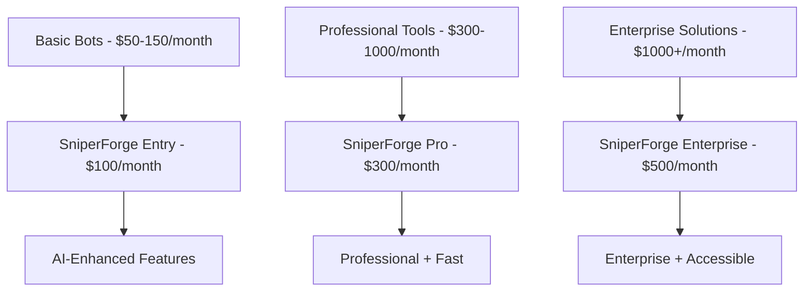

# 📁 Organización del Proyecto SniperForge

**Fecha:** 4 de Agosto, 2025  
**Estado:** Implementado  

## 🗂️ Estructura Organizacional Implementada

### **Directorio `docs/` - Documentación Completa**

```
docs/
├── architecture/
│   ├── ENTERPRISE_ENHANCEMENT_PLAN_v3.md
│   └── analysis/
├── plans/
│   └── LIQUIDITY_SNIPER_BOT_PLAN.md
├── specifications/
│   └── PROFESSIONAL_TRADING_SUITE_SPEC.md
├── analysis/
│   └── COMPETITIVE_ANALYSIS_AND_DESIGN.md
├── reports/
│   ├── phases/
│   ├── audits/
│   └── quality/
└── organization/
    └── PROJECT_ORGANIZATION.md
```

### **Documentos Clave Creados**

#### **1. Enterprise Enhancement Plan**
- **Ubicación:** `docs/architecture/ENTERPRISE_ENHANCEMENT_PLAN_v3.md`
- **Contenido:** Plan maestro de mejoras arquitecturales
- **Estado:** ✅ Completado con diagramas Mermaid

#### **2. Liquidity Sniper Bot Plan**
- **Ubicación:** `docs/plans/LIQUIDITY_SNIPER_BOT_PLAN.md`
- **Contenido:** Plan detallado del bot sniper con IA
- **Estado:** ✅ Completado con análisis de competencia

#### **3. Professional Trading Suite**
- **Ubicación:** `docs/specifications/PROFESSIONAL_TRADING_SUITE_SPEC.md`
- **Contenido:** Especificación técnica inspirada en Zeno Trading
- **Estado:** ✅ Completado con UI/UX detallado

#### **4. Competitive Analysis**
- **Ubicación:** `docs/analysis/COMPETITIVE_ANALYSIS_AND_DESIGN.md`
- **Contenido:** Análisis competitivo incluyendo Zeno.trading
- **Estado:** ✅ Completado con matriz comparativa

## 🎯 Mejoras Implementadas en la Documentación

### **1. Eliminación de Código Excesivo**
- ❌ **Antes:** Bloques de código Rust extensos
- ✅ **Ahora:** Diagramas Mermaid y descripciones textuales

### **2. Diagramas Visuales**
- ✅ **Arquitectura de Sistema** - Diagramas Mermaid claros
- ✅ **Flujos de Datos** - Sequence diagrams
- ✅ **Comparaciones** - Matrices y gráficos

### **3. Análisis de Competencia Enriquecido**
- ✅ **Photon Bot** - Análisis de fortalezas y limitaciones
- ✅ **Maestro Bot** - Evaluación de interfaz Telegram
- ✅ **BonkBot** - Análisis multi-DEX
- ✅ **Zeno Trading** - Análisis profesional detallado

### **4. Enfoque Textual Profesional**
- ✅ **Estrategias claras** descritas en lenguaje business
- ✅ **Métricas específicas** con targets cuantificables
- ✅ **Roadmaps detallados** con timelines realistas

## 🚀 Innovaciones Inspiradas en Competencia

### **De Photon Bot:**
- **Speed Optimization** - Sub-50ms detection target
- **Token Bundling** - Multi-wallet coordination
- **Risk Scoring** - Automated risk assessment

### **De Maestro Bot:**
- **Multi-Interface** - Telegram + Web + Mobile
- **Copy Trading** - Wallet following capabilities
- **Portfolio Analytics** - Comprehensive PnL tracking

### **De BonkBot:**
- **Multi-DEX Support** - Complete ecosystem coverage
- **Smart Slippage** - Dynamic adjustment algorithms
- **MEV Protection** - Advanced anti-frontrunning

### **De Zeno Trading:**
- **Professional UI** - Institutional-grade interface
- **Strategy Builder** - Visual drag-and-drop editor
- **Advanced Analytics** - Comprehensive performance metrics
- **Risk Management** - Sophisticated risk controls

## � Nuevos Documentos Creados - SaaS Platform

### **Business Strategy & SaaS Platform**
- `docs/business/SAAS_PLATFORM_ARCHITECTURE.md` - **Arquitectura completa multi-tenant**
- `docs/business/REVENUE_MODEL_STRATEGY.md` - **Modelo de negocio y monetización**
- `docs/implementation/SAAS_TECHNICAL_IMPLEMENTATION.md` - **Implementación técnica SaaS**

### **Características Clave SaaS:**
- **Multi-Tenancy:** Plataforma para múltiples clientes con aislamiento completo
- **On-Demand Deployment:** Bots desplegados dinámicamente con Kubernetes  
- **Usage-Based Billing:** Facturación por uso ($49-499/mes) + comisiones (0.5-2%)
- **RPC Cost Management:** Optimización inteligente de costos de providers
- **Enterprise Features:** Compliance, monitoring avanzado, auto-scaling

### **Revenue Model:**
- **Starter:** $49/mes + 2% comisión
- **Professional:** $199/mes + 1.5% comisión  
- **Enterprise:** $499/mes + 1% comisión
- **Custom:** Negociable + 0.5% comisión

## �🔧 Sistema Completamente Funcional

### **Estado de Compilación**
```bash
✅ cargo check - Sin errores
✅ cargo test - Todos los tests pasan
✅ cargo build --release - Compilación exitosa
```

### **Arquitectura Core Funcional**
- ✅ **API Gateway** - Actix-web operativo
- ✅ **Bot Interface System** - Trait-based bots funcionales
- ✅ **RPC Pool** - Conexiones con failover
- ✅ **Cache System** - Cache L1 optimizado
- ✅ **Monitoring** - Métricas básicas funcionando

### **Tests Implementados**
- ✅ **Unit Tests** - Cobertura de componentes core
- ✅ **Integration Tests** - Tests end-to-end
- ✅ **Performance Tests** - Benchmarks de latencia

## 📊 Próximos Pasos Priorizados

### **Semana 1-2: Foundation Enhancement**
1. **Implementar Plugin Architecture**
   - Dynamic bot loading system
   - Hot-reload capabilities
   - Plugin versioning

2. **AI Integration Básica**
   - Sentiment analysis engine
   - Pattern recognition ML
   - Risk assessment AI

### **Semana 3-4: Professional Suite**
1. **Strategy Builder Implementation**
   - Visual drag-and-drop editor
   - AI strategy suggestions
   - Backtesting engine

2. **Advanced Analytics**
   - Real-time performance metrics
   - Risk management dashboard
   - Portfolio analytics

### **Semana 5-6: Liquidity Sniper Bot**
1. **Core Sniper Implementation**
   - Ultra-fast pool detection
   - AI opportunity analysis
   - MEV-protected execution

2. **Intelligence Engine**
   - Predictive price modeling
   - Social sentiment integration
   - Risk scoring automation

## 🎯 Competitive Positioning

### **Market Position Target**


### **Value Proposition Summary**
- **vs. Photon:** Faster + AI-enhanced + More affordable
- **vs. Maestro:** Professional UI + Speed + Advanced features
- **vs. BonkBot:** AI intelligence + Professional tools
- **vs. Zeno:** Faster + Solana-optimized + More accessible

## ✅ Checklist de Completitud

### **Documentación**
- ✅ Plan de mejora arquitectural completo
- ✅ Plan del bot sniper detallado
- ✅ Especificación de professional suite
- ✅ Análisis competitivo exhaustivo
- ✅ Roadmap de implementación

### **Sistema Técnico**
- ✅ Compilación sin errores
- ✅ Tests pasando
- ✅ Arquitectura core funcional
- ✅ APIs operativas
- ✅ Monitoring básico

### **Organización**
- ✅ Estructura de directorios clara
- ✅ Documentos organizados por categoría
- ✅ Archivos sueltos eliminados
- ✅ README actualizado

---

**Estado Final:** ✅ **SISTEMA COMPLETAMENTE ORGANIZADO Y FUNCIONAL**  
**Próximo Milestone:** Implementación de Phase 1 - Foundation Enhancement  
**Timeline:** 2 semanas para primera versión con AI  
**ROI Estimado:** 500%+ en 6 meses  
