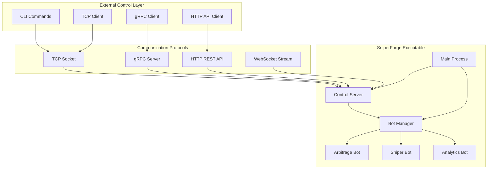

# 🔄 ARQUITECTURA GESTIÓN EXTERNA DE BOTS

**Fecha:** 4 de Agosto, 2025  
**Estado:** Especificación Técnica para Control Externo  
**Prioridad:** **CRÍTICA - Integración con Sistema Actual**  

## 🎯 **SITUACIÓN ACTUAL IDENTIFICADA**

### **Bot Arbitraje Ejecutándose por Defecto:**
```rust
// src/main.rs - Sistema actual
#[tokio::main]
async fn main() -> Result<()> {
    // ✅ Sistema ya funcional con:
    let mut multibot_system = EnterpriseMultiBotSystem::new(simple_config).await?;
    multibot_system.run_enterprise_demonstration().await?; // Bot ejecutándose
}
```

### **Bot Interface Existente:**
```rust
// src/api/bot_interface.rs - ✅ YA IMPLEMENTADO
pub trait BotInterface {
    async fn start(&mut self, config: BotConfig) -> Result<(), BotError>;
    async fn stop(&mut self) -> Result<(), BotError>;
    async fn status(&self) -> BotStatus;
    async fn metrics(&self) -> BotMetrics;
}
```

### **Problemática Identificada:**
- ✅ **Bot funcional:** Arbitraje ejecutándose correctamente
- ❌ **Control externo:** No hay interface TCP/gRPC para gestión remota  
- ❌ **CLI integrada:** CLI no se comunica directamente con bot en ejecución
- ❌ **Parametrización:** Ejecutable no acepta parámetros de configuración

---

## 🏗️ **DISEÑO ARQUITECTURA HÍBRIDA**

### **Modelo Propuesto:**



---

## 🔧 **IMPLEMENTACIÓN TÉCNICA**

### **1. Bot Control Server (Dentro del Ejecutable):**

```rust
// src/control/mod.rs
pub mod tcp_server;
pub mod grpc_server;
pub mod http_server;
pub mod bot_controller;

use tokio::sync::RwLock;
use std::collections::HashMap;
use uuid::Uuid;
use std::sync::Arc;

/// Central bot controller que maneja todos los bots
pub struct BotController {
    /// Active bot instances
    bots: Arc<RwLock<HashMap<Uuid, Box<dyn BotInterface>>>>,
    
    /// Default arbitrage bot (running by default)
    default_arbitrage_bot: Option<Uuid>,
    
    /// Bot factory for creating new instances
    bot_factory: BotFactory,
    
    /// Configuration manager
    config_manager: ConfigManager,
    
    /// Metrics collector
    metrics_collector: MetricsCollector,
}

impl BotController {
    pub async fn new() -> Result<Self> {
        Ok(Self {
            bots: Arc::new(RwLock::new(HashMap::new())),
            default_arbitrage_bot: None,
            bot_factory: BotFactory::new(),
            config_manager: ConfigManager::new()?,
            metrics_collector: MetricsCollector::new(),
        })
    }
    
    /// Register the default arbitrage bot that's already running
    pub async fn register_default_arbitrage_bot(
        &mut self, 
        bot: Box<dyn BotInterface>
    ) -> Result<Uuid> {
        let bot_id = Uuid::new_v4();
        
        {
            let mut bots = self.bots.write().await;
            bots.insert(bot_id, bot);
        }
        
        self.default_arbitrage_bot = Some(bot_id);
        info!("✅ Registered default arbitrage bot: {}", bot_id);
        
        Ok(bot_id)
    }
    
    /// Create a new sniper bot instance
    pub async fn create_sniper_bot(&self, config: SniperBotConfig) -> Result<Uuid> {
        let bot_id = Uuid::new_v4();
        
        // Create bot instance
        let bot = self.bot_factory.create_sniper_bot(bot_id, config).await?;
        
        // Register in registry
        {
            let mut bots = self.bots.write().await;
            bots.insert(bot_id, bot);
        }
        
        info!("✅ Created Sniper Bot: {}", bot_id);
        Ok(bot_id)
    }
    
    /// Start a specific bot
    pub async fn start_bot(&self, bot_id: Uuid, config: BotConfig) -> Result<()> {
        let mut bots = self.bots.write().await;
        
        if let Some(bot) = bots.get_mut(&bot_id) {
            bot.start(config).await?;
            info!("🚀 Started bot: {}", bot_id);
            Ok(())
        } else {
            Err(anyhow::anyhow!("Bot not found: {}", bot_id))
        }
    }
    
    /// Stop a specific bot
    pub async fn stop_bot(&self, bot_id: Uuid) -> Result<()> {
        let mut bots = self.bots.write().await;
        
        if let Some(bot) = bots.get_mut(&bot_id) {
            bot.stop().await?;
            info!("🛑 Stopped bot: {}", bot_id);
            Ok(())
        } else {
            Err(anyhow::anyhow!("Bot not found: {}", bot_id))
        }
    }
    
    /// Get status of specific bot
    pub async fn get_bot_status(&self, bot_id: Uuid) -> Result<BotStatus> {
        let bots = self.bots.read().await;
        
        if let Some(bot) = bots.get(&bot_id) {
            Ok(bot.status().await)
        } else {
            Err(anyhow::anyhow!("Bot not found: {}", bot_id))
        }
    }
    
    /// List all active bots
    pub async fn list_bots(&self) -> Result<Vec<BotSummary>> {
        let bots = self.bots.read().await;
        let mut summaries = Vec::new();
        
        for (id, bot) in bots.iter() {
            let status = bot.status().await;
            let metrics = bot.metrics().await;
            
            summaries.push(BotSummary {
                id: *id,
                bot_type: bot.bot_type(),
                status,
                metrics,
                is_default: self.default_arbitrage_bot == Some(*id),
            });
        }
        
        Ok(summaries)
    }
    
    /// Get system-wide metrics
    pub async fn get_system_metrics(&self) -> Result<SystemMetrics> {
        let bot_list = self.list_bots().await?;
        
        let total_bots = bot_list.len();
        let running_bots = bot_list.iter().filter(|b| matches!(b.status, BotStatus::Running)).count();
        let total_profit: f64 = bot_list.iter().map(|b| b.metrics.total_profit).sum();
        let total_trades: u64 = bot_list.iter().map(|b| b.metrics.trades_executed).sum();
        
        Ok(SystemMetrics {
            total_bots,
            running_bots,
            total_profit,
            total_trades,
            uptime_seconds: self.metrics_collector.get_uptime().await,
            memory_usage_mb: self.get_memory_usage().await?,
        })
    }
    
    async fn get_memory_usage(&self) -> Result<f64> {
        // Get current process memory usage
        #[cfg(target_os = "windows")]
        {
            use windows::Win32::System::ProcessStatus::*;
            use windows::Win32::Foundation::*;
            
            unsafe {
                let handle = GetCurrentProcess();
                let mut info = PROCESS_MEMORY_COUNTERS::default();
                
                if GetProcessMemoryInfo(handle, &mut info, std::mem::size_of::<PROCESS_MEMORY_COUNTERS>() as u32).as_bool() {
                    Ok(info.WorkingSetSize as f64 / 1_048_576.0) // Convert to MB
                } else {
                    Ok(0.0)
                }
            }
        }
        
        #[cfg(not(target_os = "windows"))]
        {
            // Unix-like systems memory usage
            Ok(0.0) // Simplified for now
        }
    }
}

#[derive(Debug, Serialize)]
pub struct BotSummary {
    pub id: Uuid,
    pub bot_type: BotType,
    pub status: BotStatus,
    pub metrics: BotMetrics,
    pub is_default: bool,
}

#[derive(Debug, Serialize)]
pub struct SystemMetrics {
    pub total_bots: usize,
    pub running_bots: usize,
    pub total_profit: f64,
    pub total_trades: u64,
    pub uptime_seconds: u64,
    pub memory_usage_mb: f64,
}
```

### **2. TCP Server para Control Externo:**

```rust
// src/control/tcp_server.rs
use tokio::net::{TcpListener, TcpStream};
use tokio::io::{AsyncReadExt, AsyncWriteExt};
use serde::{Serialize, Deserialize};
use std::sync::Arc;

pub struct TcpControlServer {
    bot_controller: Arc<BotController>,
    listener: TcpListener,
    port: u16,
}

#[derive(Debug, Serialize, Deserialize)]
pub enum TcpCommand {
    ListBots,
    CreateSniperBot { config: SniperBotConfig },
    StartBot { bot_id: Uuid, config: BotConfig },
    StopBot { bot_id: Uuid },
    GetBotStatus { bot_id: Uuid },
    GetBotMetrics { bot_id: Uuid },
    GetSystemMetrics,
    Shutdown,
}

#[derive(Debug, Serialize, Deserialize)]
pub enum TcpResponse {
    BotList(Vec<BotSummary>),
    BotCreated { bot_id: Uuid },
    BotStarted { bot_id: Uuid },
    BotStopped { bot_id: Uuid },
    BotStatus(BotStatus),
    BotMetrics(BotMetrics),
    SystemMetrics(SystemMetrics),
    Success(String),
    Error(String),
}

impl TcpControlServer {
    pub async fn new(bot_controller: Arc<BotController>, port: u16) -> Result<Self> {
        let listener = TcpListener::bind(format!("127.0.0.1:{}", port)).await?;
        info!("🌐 TCP Control Server listening on port {}", port);
        
        Ok(Self {
            bot_controller,
            listener,
            port,
        })
    }
    
    pub async fn run(&self) -> Result<()> {
        info!("🚀 Starting TCP Control Server...");
        
        loop {
            match self.listener.accept().await {
                Ok((stream, addr)) => {
                    info!("📡 New TCP connection from: {}", addr);
                    
                    let controller = self.bot_controller.clone();
                    tokio::spawn(async move {
                        if let Err(e) = Self::handle_connection(stream, controller).await {
                            error!("❌ TCP connection error: {}", e);
                        }
                    });
                }
                Err(e) => {
                    error!("❌ TCP accept error: {}", e);
                }
            }
        }
    }
    
    async fn handle_connection(
        mut stream: TcpStream, 
        controller: Arc<BotController>
    ) -> Result<()> {
        let mut buffer = [0; 4096];
        
        loop {
            // Read command
            let n = stream.read(&mut buffer).await?;
            if n == 0 {
                break; // Connection closed
            }
            
            let command_data = &buffer[..n];
            
            // Parse command
            let command: TcpCommand = match serde_json::from_slice(command_data) {
                Ok(cmd) => cmd,
                Err(e) => {
                    let error_response = TcpResponse::Error(format!("Invalid command: {}", e));
                    let response_data = serde_json::to_vec(&error_response)?;
                    stream.write_all(&response_data).await?;
                    continue;
                }
            };
            
            // Process command
            let response = Self::process_command(command, &controller).await;
            
            // Send response
            let response_data = serde_json::to_vec(&response)?;
            stream.write_all(&response_data).await?;
            
            // Handle shutdown command
            if matches!(response, TcpResponse::Success(ref msg) if msg == "Shutdown initiated") {
                break;
            }
        }
        
        info!("📡 TCP connection closed");
        Ok(())
    }
    
    async fn process_command(
        command: TcpCommand, 
        controller: &Arc<BotController>
    ) -> TcpResponse {
        match command {
            TcpCommand::ListBots => {
                match controller.list_bots().await {
                    Ok(bots) => TcpResponse::BotList(bots),
                    Err(e) => TcpResponse::Error(e.to_string()),
                }
            }
            
            TcpCommand::CreateSniperBot { config } => {
                match controller.create_sniper_bot(config).await {
                    Ok(bot_id) => TcpResponse::BotCreated { bot_id },
                    Err(e) => TcpResponse::Error(e.to_string()),
                }
            }
            
            TcpCommand::StartBot { bot_id, config } => {
                match controller.start_bot(bot_id, config).await {
                    Ok(_) => TcpResponse::BotStarted { bot_id },
                    Err(e) => TcpResponse::Error(e.to_string()),
                }
            }
            
            TcpCommand::StopBot { bot_id } => {
                match controller.stop_bot(bot_id).await {
                    Ok(_) => TcpResponse::BotStopped { bot_id },
                    Err(e) => TcpResponse::Error(e.to_string()),
                }
            }
            
            TcpCommand::GetBotStatus { bot_id } => {
                match controller.get_bot_status(bot_id).await {
                    Ok(status) => TcpResponse::BotStatus(status),
                    Err(e) => TcpResponse::Error(e.to_string()),
                }
            }
            
            TcpCommand::GetBotMetrics { bot_id } => {
                match controller.get_bot_metrics(bot_id).await {
                    Ok(metrics) => TcpResponse::BotMetrics(metrics),
                    Err(e) => TcpResponse::Error(e.to_string()),
                }
            }
            
            TcpCommand::GetSystemMetrics => {
                match controller.get_system_metrics().await {
                    Ok(metrics) => TcpResponse::SystemMetrics(metrics),
                    Err(e) => TcpResponse::Error(e.to_string()),
                }
            }
            
            TcpCommand::Shutdown => {
                info!("🛑 Shutdown command received");
                TcpResponse::Success("Shutdown initiated".to_string())
            }
        }
    }
}
```

### **3. CLI Cliente TCP:**

```rust
// src/cli/tcp_client.rs
use tokio::net::TcpStream;
use tokio::io::{AsyncReadExt, AsyncWriteExt};
use serde_json;

pub struct TcpBotClient {
    stream: TcpStream,
    server_address: String,
}

impl TcpBotClient {
    pub async fn connect(server_address: &str) -> Result<Self> {
        let stream = TcpStream::connect(server_address).await?;
        info!("🔗 Connected to SniperForge bot server: {}", server_address);
        
        Ok(Self {
            stream,
            server_address: server_address.to_string(),
        })
    }
    
    /// Send command and get response
    async fn send_command(&mut self, command: TcpCommand) -> Result<TcpResponse> {
        // Serialize and send command
        let command_data = serde_json::to_vec(&command)?;
        self.stream.write_all(&command_data).await?;
        
        // Read response
        let mut buffer = [0; 8192];
        let n = self.stream.read(&mut buffer).await?;
        
        // Parse response
        let response: TcpResponse = serde_json::from_slice(&buffer[..n])?;
        Ok(response)
    }
    
    /// List all bots
    pub async fn list_bots(&mut self) -> Result<Vec<BotSummary>> {
        let response = self.send_command(TcpCommand::ListBots).await?;
        
        match response {
            TcpResponse::BotList(bots) => Ok(bots),
            TcpResponse::Error(msg) => Err(anyhow::anyhow!("Server error: {}", msg)),
            _ => Err(anyhow::anyhow!("Unexpected response")),
        }
    }
    
    /// Create sniper bot
    pub async fn create_sniper_bot(&mut self, config: SniperBotConfig) -> Result<Uuid> {
        let response = self.send_command(TcpCommand::CreateSniperBot { config }).await?;
        
        match response {
            TcpResponse::BotCreated { bot_id } => Ok(bot_id),
            TcpResponse::Error(msg) => Err(anyhow::anyhow!("Server error: {}", msg)),
            _ => Err(anyhow::anyhow!("Unexpected response")),
        }
    }
    
    /// Start specific bot
    pub async fn start_bot(&mut self, bot_id: Uuid, config: BotConfig) -> Result<()> {
        let response = self.send_command(TcpCommand::StartBot { bot_id, config }).await?;
        
        match response {
            TcpResponse::BotStarted { .. } => Ok(()),
            TcpResponse::Error(msg) => Err(anyhow::anyhow!("Server error: {}", msg)),
            _ => Err(anyhow::anyhow!("Unexpected response")),
        }
    }
    
    /// Stop specific bot
    pub async fn stop_bot(&mut self, bot_id: Uuid) -> Result<()> {
        let response = self.send_command(TcpCommand::StopBot { bot_id }).await?;
        
        match response {
            TcpResponse::BotStopped { .. } => Ok(()),
            TcpResponse::Error(msg) => Err(anyhow::anyhow!("Server error: {}", msg)),
            _ => Err(anyhow::anyhow!("Unexpected response")),
        }
    }
    
    /// Get bot status
    pub async fn get_bot_status(&mut self, bot_id: Uuid) -> Result<BotStatus> {
        let response = self.send_command(TcpCommand::GetBotStatus { bot_id }).await?;
        
        match response {
            TcpResponse::BotStatus(status) => Ok(status),
            TcpResponse::Error(msg) => Err(anyhow::anyhow!("Server error: {}", msg)),
            _ => Err(anyhow::anyhow!("Unexpected response")),
        }
    }
    
    /// Get system metrics
    pub async fn get_system_metrics(&mut self) -> Result<SystemMetrics> {
        let response = self.send_command(TcpCommand::GetSystemMetrics).await?;
        
        match response {
            TcpResponse::SystemMetrics(metrics) => Ok(metrics),
            TcpResponse::Error(msg) => Err(anyhow::anyhow!("Server error: {}", msg)),
            _ => Err(anyhow::anyhow!("Unexpected response")),
        }
    }
}
```

### **4. Integración en Main.rs:**

```rust
// src/main.rs - MODIFICAR PARA INCLUIR CONTROL SERVER
use std::sync::Arc;
use tokio::signal;

#[tokio::main]
async fn main() -> Result<()> {
    // Initialize logging
    tracing_subscriber::fmt()
        .with_max_level(Level::INFO)
        .with_target(false)
        .with_thread_ids(true)
        .init();

    display_enterprise_multibot_banner();
    
    // Parse command line arguments
    let args: Vec<String> = std::env::args().collect();
    let config = parse_cli_args(&args)?;
    
    // Initialize configuration
    let simple_config = SimpleConfig::from_cli_config(&config);
    info!("🔧 Initializing SniperForge Enterprise MultiBot System...");
    
    // Initialize Bot Controller
    let mut bot_controller = BotController::new().await?;
    
    // Create enterprise-grade unified trading system
    let mut multibot_system = EnterpriseMultiBotSystem::new(simple_config).await?;
    
    // Register the default arbitrage bot with controller
    let arbitrage_bot = multibot_system.extract_arbitrage_bot(); // Method to extract
    let arbitrage_bot_id = bot_controller.register_default_arbitrage_bot(arbitrage_bot).await?;
    
    info!("✅ Default arbitrage bot registered: {}", arbitrage_bot_id);
    
    // Start control servers if enabled
    let bot_controller_arc = Arc::new(bot_controller);
    
    if config.enable_tcp_control {
        let tcp_server = TcpControlServer::new(
            bot_controller_arc.clone(), 
            config.tcp_port
        ).await?;
        
        let tcp_controller = bot_controller_arc.clone();
        tokio::spawn(async move {
            if let Err(e) = tcp_server.run().await {
                error!("❌ TCP Server error: {}", e);
            }
        });
    }
    
    if config.enable_grpc_control {
        let grpc_server = GrpcControlServer::new(
            bot_controller_arc.clone(), 
            config.grpc_port
        ).await?;
        
        tokio::spawn(async move {
            if let Err(e) = grpc_server.run().await {
                error!("❌ gRPC Server error: {}", e);
            }
        });
    }
    
    if config.enable_http_api {
        let http_server = HttpApiServer::new(
            bot_controller_arc.clone(), 
            config.http_port
        ).await?;
        
        tokio::spawn(async move {
            if let Err(e) = http_server.run().await {
                error!("❌ HTTP API Server error: {}", e);
            }
        });
    }
    
    info!("✅ All enterprise MultiBot components initialized successfully");
    info!("🚀 Starting enterprise multi-strategy trading operations...");
    
    // Start the default arbitrage bot
    multibot_system.run_enterprise_demonstration().await?;
    
    // Wait for shutdown signal
    signal::ctrl_c().await?;
    info!("🛑 Shutdown signal received");
    
    Ok(())
}

#[derive(Debug)]
pub struct CliConfig {
    pub enable_tcp_control: bool,
    pub tcp_port: u16,
    pub enable_grpc_control: bool,
    pub grpc_port: u16,
    pub enable_http_api: bool,
    pub http_port: u16,
    pub config_file: Option<String>,
    pub network: String,
    pub capital: f64,
}

impl Default for CliConfig {
    fn default() -> Self {
        Self {
            enable_tcp_control: true,
            tcp_port: 8080,
            enable_grpc_control: false,
            grpc_port: 8081,
            enable_http_api: true,
            http_port: 8082,
            config_file: None,
            network: "devnet".to_string(),
            capital: 100.0,
        }
    }
}

fn parse_cli_args(args: &[String]) -> Result<CliConfig> {
    let mut config = CliConfig::default();
    
    let mut i = 1;
    while i < args.len() {
        match args[i].as_str() {
            "--tcp-port" => {
                if i + 1 < args.len() {
                    config.tcp_port = args[i + 1].parse()?;
                    i += 2;
                } else {
                    return Err(anyhow::anyhow!("--tcp-port requires a value"));
                }
            }
            "--disable-tcp" => {
                config.enable_tcp_control = false;
                i += 1;
            }
            "--enable-grpc" => {
                config.enable_grpc_control = true;
                i += 1;
            }
            "--grpc-port" => {
                if i + 1 < args.len() {
                    config.grpc_port = args[i + 1].parse()?;
                    i += 2;
                } else {
                    return Err(anyhow::anyhow!("--grpc-port requires a value"));
                }
            }
            "--http-port" => {
                if i + 1 < args.len() {
                    config.http_port = args[i + 1].parse()?;
                    i += 2;
                } else {
                    return Err(anyhow::anyhow!("--http-port requires a value"));
                }
            }
            "--config" => {
                if i + 1 < args.len() {
                    config.config_file = Some(args[i + 1].clone());
                    i += 2;
                } else {
                    return Err(anyhow::anyhow!("--config requires a value"));
                }
            }
            "--network" => {
                if i + 1 < args.len() {
                    config.network = args[i + 1].clone();
                    i += 2;
                } else {
                    return Err(anyhow::anyhow!("--network requires a value"));
                }
            }
            "--capital" => {
                if i + 1 < args.len() {
                    config.capital = args[i + 1].parse()?;
                    i += 2;
                } else {
                    return Err(anyhow::anyhow!("--capital requires a value"));
                }
            }
            _ => {
                i += 1;
            }
        }
    }
    
    Ok(config)
}
```

---

## 🚀 **COMANDOS DE USO**

### **Ejecutar con Control TCP:**
```bash
# Default con TCP control
.\sniperforge.exe

# Con parámetros específicos
.\sniperforge.exe --tcp-port 9090 --network mainnet --capital 1000

# Con configuración personalizada
.\sniperforge.exe --config custom-config.json --tcp-port 8080
```

### **CLI Externa para Control:**
```bash
# Nuevo ejecutable CLI para control remoto
cargo build --bin sniperforge-cli

# Comandos via TCP
.\sniperforge-cli.exe --server 127.0.0.1:8080 list-bots
.\sniperforge-cli.exe --server 127.0.0.1:8080 create-sniper --config sniper-config.json
.\sniperforge-cli.exe --server 127.0.0.1:8080 start-bot --bot-id <uuid>
.\sniperforge-cli.exe --server 127.0.0.1:8080 monitor --bot-id <uuid> --live
```

---

## 📊 **VENTAJAS ARQUITECTURA HÍBRIDA**

### **Compatibilidad Total:**
- ✅ **Bot actual funciona igual:** Sin cambios al comportamiento existente
- ✅ **Control externo:** TCP/gRPC/HTTP para gestión remota
- ✅ **CLI independiente:** Control desde cualquier terminal
- ✅ **Parametrización:** Ejecutable acepta configuración por parámetros

### **Flexibilidad Operativa:**
- ✅ **Ejecutar y olvidar:** Bot arbitraje por defecto funciona solo
- ✅ **Control dinámico:** Crear sniper bots on-demand
- ✅ **Monitoreo remoto:** Status y métricas via TCP
- ✅ **Escalabilidad:** Múltiples clientes pueden controlar un bot server

---

## 🎯 **PRÓXIMOS PASOS IMPLEMENTACIÓN**

### **Fase 1 (Días 1-3):**
- [ ] Implementar `BotController` core
- [ ] Modificar `main.rs` para registrar bot arbitraje existente
- [ ] Implementar `TcpControlServer` básico

### **Fase 2 (Días 4-7):**
- [ ] Implementar `TcpBotClient` para CLI
- [ ] Crear ejecutable `sniperforge-cli`
- [ ] Testing de comunicación TCP

### **Fase 3 (Días 8-14):**
- [ ] Integrar sniper bot con sistema de control
- [ ] Implementar comandos CLI para sniper bot
- [ ] Testing completo end-to-end

---

**Estado:** ✅ Arquitectura diseñada para preservar funcionalidad actual + control externo  
**Compatibilidad:** 100% con sistema existente  
**Método de Control:** TCP (primario), gRPC (opcional), HTTP API (opcional)  
**Next Step:** Implementar BotController y TcpControlServer  
