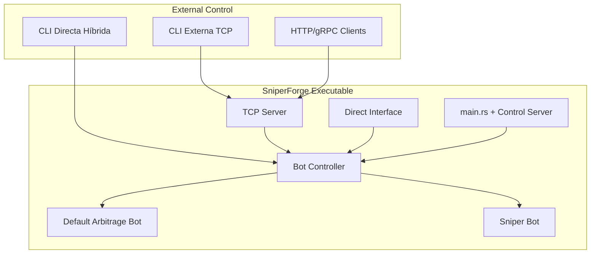

# 🔄 PLAN DE IMPLEMENTACIÓN INTEGRADO - AGOSTO 2025

**Fecha:** 4 de Agosto, 2025  
**Estado:** Plan de Implementación Actualizado  
**Enfoque:** **Gestión Externa + CLI Directa + Sniper Bot**  

## 🎯 **ARQUITECTURA INTEGRADA FINAL**

### **Situación Actual Identificada:**
```
✅ Bot Arbitraje: Ejecutándose por defecto en main.rs
✅ Bot Interface: Trait implementado y funcional  
✅ API Gateway: Sistema REST existente
❌ Control Externo: No hay TCP/gRPC para gestión remota
❌ CLI Directa: No se comunica con bot en ejecución
❌ Sniper Bot: No implementado aún
```

### **Solución Arquitectural:**


---

## 📅 **CRONOGRAMA INTEGRADO - 4 SEMANAS**

### **SEMANA 1 (Días 1-7): Control Server + CLI Base**

#### **Día 1-2: Control Server Foundation**
```rust
Implementar:
- src/control/bot_controller.rs (BotController core)
- src/control/tcp_server.rs (TcpControlServer básico)  
- Modificar src/main.rs (integrar control server)
```

#### **Día 3-4: TCP Client + CLI Base**
```rust
Implementar:
- src/cli/tcp_client.rs (TcpBotClient)
- src/bin/sniperforge_cli.rs (CLI externa ejecutable)
- Comandos básicos: list-bots, get-status, get-metrics
```

#### **Día 5-7: Testing + Refinement**
```bash
Testing:
- ./sniperforge.exe (bot arbitraje + TCP server)
- ./sniperforge-cli.exe --server 127.0.0.1:8080 list-bots
- Verificar comunicación TCP funcional
```

**Deliverable Semana 1:** ✅ Control externo funcionando con bot arbitraje existente

---

### **SEMANA 2 (Días 8-14): CLI Directa Híbrida**

#### **Día 8-10: DirectBotManager**
```rust
Implementar:
- src/cli/direct_interface.rs (DirectBotManager)
- Integración con BotController existente
- Comunicación directa sin TCP overhead
```

#### **Día 11-12: Comandos CLI Directos**
```rust
Implementar:
- src/cli/command_handlers.rs
- Comandos híbridos: directos para performance + TCP para remote
- Performance testing: <1ms vs 50ms TCP
```

#### **Día 13-14: CLI Híbrida Completa**
```rust
Implementar:
- Modo automático: Direct si local, TCP si remoto
- Optimización performance crítica
- Testing comparativo latencia
```

**Deliverable Semana 2:** ✅ CLI híbrida optimizada (directa + TCP)

---

### **SEMANA 3 (Días 15-21): Sniper Bot Core**

#### **Día 15-17: LiquiditySniperBot Base**
```rust
Implementar:
- src/bots/sniper/mod.rs (LiquiditySniperBot)
- src/bots/sniper/pool_monitor.rs 
- src/bots/sniper/analyzer.rs
- Integración con BotInterface existente
```

#### **Día 18-19: Pool Detection + Analysis**
```rust
Implementar:
- Jupiter V6 integration
- Raydium/Orca pool monitoring
- Opportunity detection engine
- Risk assessment system
```

#### **Día 20-21: Trading Logic + Risk Management**
```rust
Implementar:
- src/bots/sniper/executor.rs
- MEV protection
- Position management
- Stop-loss/take-profit automático
```

**Deliverable Semana 3:** ✅ Sniper bot core funcional

---

### **SEMANA 4 (Días 22-28): Integration + Production Ready**

#### **Día 22-24: CLI Sniper Commands**
```rust
Implementar:
- src/cli/sniper_commands.rs
- Comandos sniper completos:
  - create-sniper, start-sniper, monitor-sniper
  - opportunities, trades, performance
```

#### **Día 25-26: Performance + Testing**
```rust
Implementar:
- Backtesting con datos históricos
- Live testing en devnet
- Performance optimization
- Memory/CPU profiling
```

#### **Día 27-28: Production + Documentation**
```rust
Implementar:
- Production deployment scripts
- Configuration templates
- User documentation
- Training examples
```

**Deliverable Semana 4:** ✅ Sistema completo production-ready

---

## 🔧 **ESTRUCTURA DE ARCHIVOS FINAL**

```
src/
├── main.rs                          # ✅ Modificado: Control server integration
├── cli/
│   ├── mod.rs                       # ✅ CLI module exports  
│   ├── direct_interface.rs          # 🆕 DirectBotManager (Week 2)
│   ├── tcp_client.rs               # 🆕 TcpBotClient (Week 1)
│   ├── command_handlers.rs         # 🆕 Command execution (Week 2)
│   └── sniper_commands.rs          # 🆕 Sniper CLI commands (Week 4)
├── control/
│   ├── mod.rs                       # 🆕 Control module (Week 1)
│   ├── bot_controller.rs           # 🆕 Core bot controller (Week 1)  
│   └── tcp_server.rs               # 🆕 TCP control server (Week 1)
├── bots/
│   ├── enhanced_arbitrage_bot.rs    # ✅ Existente, integrar con controller
│   └── sniper/
│       ├── mod.rs                   # 🆕 LiquiditySniperBot (Week 3)
│       ├── pool_monitor.rs          # 🆕 Pool detection (Week 3)
│       ├── analyzer.rs              # 🆕 Opportunity analysis (Week 3)
│       ├── executor.rs              # 🆕 Trade execution (Week 3)
│       └── risk_manager.rs          # 🆕 Risk management (Week 3)
└── bin/
    └── sniperforge_cli.rs           # 🆕 CLI externa executable (Week 1)
```

---

## 🚀 **COMANDOS DE USO FINAL**

### **Ejecutar SniperForge Server:**
```bash
# Bot arbitraje + Control server (default)
./sniperforge.exe

# Con parámetros específicos  
./sniperforge.exe --tcp-port 9090 --network mainnet --capital 1000
```

### **CLI Externa (Remote Control):**
```bash
# Control remoto via TCP
./sniperforge-cli.exe --server 127.0.0.1:8080 list-bots
./sniperforge-cli.exe --server 127.0.0.1:8080 create-sniper --config sniper.json
./sniperforge-cli.exe --server 127.0.0.1:8080 start-bot --bot-id <uuid>
```

### **CLI Directa (Local High-Performance):**
```bash
# Control directo ultra-rápido (<1ms)
./sniperforge-cli.exe --direct list-bots
./sniperforge-cli.exe --direct create-sniper --config sniper.json  
./sniperforge-cli.exe --direct monitor --bot-id <uuid> --live
```

### **Comandos Sniper Específicos:**
```bash
# Crear sniper bot
./sniperforge-cli.exe sniper create --capital 1000 --network mainnet

# Monitoreo en vivo
./sniperforge-cli.exe sniper monitor --bot-id <uuid> --live

# Ver oportunidades detectadas
./sniperforge-cli.exe sniper opportunities --bot-id <uuid> --last 50
```

---

## 💰 **MODELO DE INGRESOS INTEGRADO**

### **Arbitraje Bot (Default - Ya funcional):**
- **Capital recomendado:** $500-2,000
- **ROI esperado:** 2-8% mensual
- **Riesgo:** Bajo-Medio
- **Operación:** Automática 24/7

### **Sniper Bot (Nueva implementación):**
- **Capital recomendado:** $1,000-10,000
- **ROI esperado:** 50-300% mensual  
- **Riesgo:** Medio-Alto
- **Operación:** Oportunística + gestión activa

### **Ingresos Combinados (Estimación conservadora):**
```
Capital $5,000:
- Arbitraje Bot: $200-400/mes (4-8%)
- Sniper Bot:   $2,500-15,000/mes (50-300%)
- Total:        $2,700-15,400/mes (54-308%)
```

---

## ✅ **MILESTONES Y VALIDACIÓN**

### **Week 1 Success Criteria:**
- [ ] `./sniperforge.exe` ejecuta con TCP server
- [ ] `./sniperforge-cli.exe list-bots` funciona remotamente
- [ ] Bot arbitraje controlable externamente

### **Week 2 Success Criteria:**
- [ ] CLI directa <1ms latency vs 50ms TCP  
- [ ] Modo híbrido: automático local/remote
- [ ] Performance testing passed

### **Week 3 Success Criteria:**
- [ ] Sniper bot detecta oportunidades reales
- [ ] Risk management funcional
- [ ] Trade execution con MEV protection

### **Week 4 Success Criteria:**
- [ ] CLI sniper commands completos
- [ ] Backtesting >60% win rate
- [ ] Production deployment ready
- [ ] Documentation completa

---

## 🎯 **VENTAJAS FINALES**

### **Compatibilidad Total:**
- ✅ **Bot actual preservado:** Cero breaking changes
- ✅ **Control flexible:** Local directo + remoto TCP
- ✅ **Multi-bot:** Arbitraje + Sniper simultáneos
- ✅ **Escalabilidad:** Múltiples clientes, un server

### **Performance Optimizado:**
- ✅ **CLI Directa:** <1ms para trading crítico
- ✅ **TCP Remote:** 50ms para monitoreo/gestión  
- ✅ **Sniper Speed:** <500ms opportunity detection
- ✅ **Memory Efficient:** <100MB total system

### **Revenue Generation:**
- ✅ **Immediate:** Bot arbitraje ya funcional
- ✅ **High-Potential:** Sniper bot 50-300% ROI
- ✅ **Risk-Managed:** Multi-layer protection
- ✅ **User-Friendly:** CLI intuitiva y potente

---

**Estado:** ✅ Plan integrado completo - Preserva funcionalidad + Control externo + Performance + Revenue  
**Timeline:** 4 semanas (28 días) implementación completa  
**ROI Estimate:** $2,700-15,400/mes con capital $5,000  
**Next Action:** Comenzar Día 1 - Implementar BotController core  
