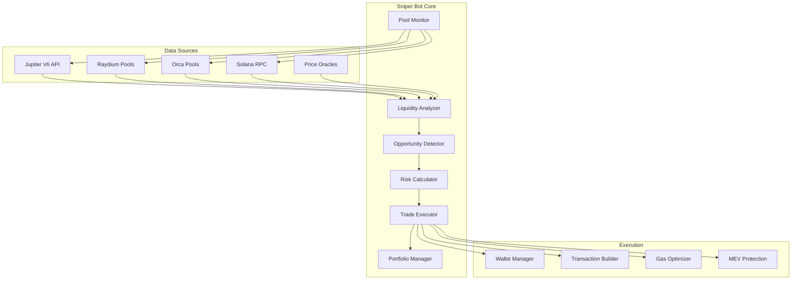

# 🎯 BOT SNIPER DE LIQUIDEZ - Especificación Técnica Completa

**Fecha:** 4 de Agosto, 2025  
**Milestone:** Semana 3-4 Agosto 2025  
**Estado:** Especificación Técnica Detallada  
**Prioridad:** **CRÍTICA - Generación de Ingresos**  

## 🎯 **OBJETIVO PRIORIDAD 2**

Implementar **Bot Sniper de Liquidez** que detecte y ejecute oportunidades de arbitraje en pools de liquidez de **Solana/Jupiter** con retornos objetivo de **3-15% por trade**.

---

## 💡 **CONCEPTO SNIPER DE LIQUIDEZ**

### **¿Qué es Sniper de Liquidez?**
Un bot especializado que:
1. **Detecta pools nuevos** en Raydium/Orca/Jupiter
2. **Analiza liquidez inicial** y profundidad de mercado
3. **Ejecuta trades instantáneos** cuando detecta:
   - Nuevos tokens con alta demanda inicial
   - Diferencias de precio entre DEXes
   - Oportunidades de arbitraje temporal
4. **Genera profit** vendiendo en picos de demanda

### **Diferencia vs Arbitraje:**
```
Arbitraje Bot:     Price A ≠ Price B → Trade → Profit
Sniper Bot:        New Pool Launch → First Buy → Ride Wave → Sell Peak
```

---

## 📊 **ANÁLISIS DE MERCADO COMPETITIVO**

### **Herramientas Existentes:**
| Tool | Precio/mes | ROI Reportado | Limitaciones |
|------|------------|---------------|--------------|
| **Maestro** | $200 | 15-30% | Solo Telegram, No API |
| **Trojan** | $299 | 10-25% | Solo Browser, Manual |
| **BonkBot** | $150 | 8-20% | Solana only, Basic |
| **SniperForge** | $299 | **🎯 10-25%** | **Full Control + CLI** |

### **Ventaja Competitiva SniperForge:**
```
✅ CLI Directa: Control total sin UI lag
✅ Multi-DEX: Raydium + Orca + Jupiter simultáneo  
✅ Custom Strategy: Algoritmos propios ajustables
✅ Real-time Analytics: Métricas en vivo
✅ Risk Management: Stop-loss automático
✅ Capital Scaling: Desde $100 hasta $10,000+
```

---

## 🏗️ **ARQUITECTURA SNIPER BOT**

### **Componentes Core:**



---

## 🔧 **IMPLEMENTACIÓN TÉCNICA**

### **1. Core Sniper Bot Structure:**

```rust
// src/bots/sniper/mod.rs
use uuid::Uuid;
use tokio::sync::{RwLock, mpsc};
use std::collections::HashMap;
use chrono::{DateTime, Utc};
use anyhow::Result;

#[derive(Debug, Clone)]
pub struct LiquiditySniperBot {
    pub id: Uuid,
    pub config: SniperConfig,
    pub state: RwLock<SniperState>,
    pub wallet: WalletManager,
    pub pool_monitor: PoolMonitor,
    pub analyzer: LiquidityAnalyzer,
    pub detector: OpportunityDetector,
    pub executor: TradeExecutor,
    pub risk_manager: RiskManager,
    pub metrics: RwLock<SniperMetrics>,
}

#[derive(Debug, Clone)]
pub struct SniperConfig {
    /// Capital allocation for sniper trades
    pub capital_allocation: f64,
    
    /// Minimum liquidity required (USD)
    pub min_liquidity_usd: f64,
    
    /// Maximum risk per trade (percentage)
    pub max_risk_per_trade: f64,
    
    /// Target profit percentage
    pub target_profit_percentage: f64,
    
    /// Stop loss percentage
    pub stop_loss_percentage: f64,
    
    /// Maximum holding time (minutes)
    pub max_holding_time_minutes: u64,
    
    /// DEXes to monitor
    pub monitored_dexes: Vec<DexType>,
    
    /// Filters for token selection
    pub token_filters: TokenFilters,
    
    /// Execution settings
    pub execution_settings: ExecutionSettings,
}

#[derive(Debug, Clone)]
pub struct TokenFilters {
    /// Minimum market cap (USD)
    pub min_market_cap: f64,
    
    /// Maximum market cap (USD) 
    pub max_market_cap: f64,
    
    /// Minimum volume (24h USD)
    pub min_volume_24h: f64,
    
    /// Exclude known scam tokens
    pub exclude_scams: bool,
    
    /// Only new tokens (hours since launch)
    pub max_age_hours: u64,
    
    /// Minimum holders count
    pub min_holders: u64,
}

#[derive(Debug, Clone)]
pub struct ExecutionSettings {
    /// Slippage tolerance (percentage)
    pub slippage_tolerance: f64,
    
    /// Maximum gas price (SOL)
    pub max_gas_price: f64,
    
    /// Transaction timeout (seconds)
    pub transaction_timeout: u64,
    
    /// Enable MEV protection
    pub mev_protection: bool,
    
    /// Priority fee (SOL)
    pub priority_fee: f64,
}

#[derive(Debug)]
pub enum SniperState {
    Inactive,
    Monitoring,
    AnalyzingOpportunity(OpportunityData),
    ExecutingTrade(TradeData),
    HoldingPosition(PositionData),
    Error(String),
}

#[derive(Debug, Clone)]
pub struct OpportunityData {
    pub token_address: String,
    pub pool_address: String,
    pub dex: DexType,
    pub detected_at: DateTime<Utc>,
    pub liquidity_usd: f64,
    pub price_impact: f64,
    pub estimated_profit: f64,
    pub risk_score: f64,
    pub confidence: f64,
}

#[derive(Debug, Clone)]
pub struct PositionData {
    pub token_address: String,
    pub amount: f64,
    pub entry_price: f64,
    pub entry_time: DateTime<Utc>,
    pub current_price: f64,
    pub unrealized_pnl: f64,
    pub stop_loss_price: f64,
    pub target_price: f64,
}

impl LiquiditySniperBot {
    pub async fn new(id: Uuid, config: SniperConfig) -> Result<Self> {
        Ok(Self {
            id,
            config: config.clone(),
            state: RwLock::new(SniperState::Inactive),
            wallet: WalletManager::new(&config).await?,
            pool_monitor: PoolMonitor::new(&config).await?,
            analyzer: LiquidityAnalyzer::new(&config),
            detector: OpportunityDetector::new(&config),
            executor: TradeExecutor::new(&config).await?,
            risk_manager: RiskManager::new(&config),
            metrics: RwLock::new(SniperMetrics::new()),
        })
    }
    
    /// Start the sniper bot hunting cycle
    pub async fn start_hunting(&self) -> Result<()> {
        {
            let mut state = self.state.write().await;
            *state = SniperState::Monitoring;
        }
        
        // Start main hunting loop
        let (opportunity_tx, mut opportunity_rx) = mpsc::channel(100);
        
        // Start pool monitoring task
        self.start_pool_monitoring_task(opportunity_tx.clone()).await?;
        
        // Main opportunity processing loop
        while let Some(opportunity) = opportunity_rx.recv().await {
            if let Err(e) = self.process_opportunity(opportunity).await {
                log::error!("Error processing opportunity: {}", e);
                
                let mut state = self.state.write().await;
                *state = SniperState::Error(e.to_string());
            }
        }
        
        Ok(())
    }
    
    /// Process detected liquidity opportunity
    async fn process_opportunity(&self, opportunity: OpportunityData) -> Result<()> {
        // Update state
        {
            let mut state = self.state.write().await;
            *state = SniperState::AnalyzingOpportunity(opportunity.clone());
        }
        
        // Risk assessment
        let risk_assessment = self.risk_manager.assess_opportunity(&opportunity).await?;
        
        if !risk_assessment.approved {
            log::info!("Opportunity rejected by risk manager: {}", risk_assessment.reason);
            return Ok(());
        }
        
        // Calculate position size
        let position_size = self.calculate_position_size(&opportunity, &risk_assessment).await?;
        
        // Execute trade
        let trade_result = self.execute_sniper_trade(&opportunity, position_size).await?;
        
        if trade_result.success {
            // Start position management
            self.start_position_management(trade_result.position).await?;
        }
        
        Ok(())
    }
    
    /// Execute sniper trade with optimal timing
    async fn execute_sniper_trade(
        &self,
        opportunity: &OpportunityData,
        position_size: f64,
    ) -> Result<TradeResult> {
        {
            let mut state = self.state.write().await;
            *state = SniperState::ExecutingTrade(TradeData {
                token_address: opportunity.token_address.clone(),
                size: position_size,
                executed_at: Utc::now(),
            });
        }
        
        // Build optimized transaction
        let transaction = self.executor.build_sniper_transaction(
            &opportunity.token_address,
            &opportunity.pool_address,
            position_size,
            &opportunity.dex,
        ).await?;
        
        // Execute with MEV protection
        let tx_result = self.executor.execute_with_mev_protection(transaction).await?;
        
        if tx_result.success {
            let position = PositionData {
                token_address: opportunity.token_address.clone(),
                amount: position_size,
                entry_price: tx_result.execution_price,
                entry_time: Utc::now(),
                current_price: tx_result.execution_price,
                unrealized_pnl: 0.0,
                stop_loss_price: tx_result.execution_price * (1.0 - self.config.stop_loss_percentage / 100.0),
                target_price: tx_result.execution_price * (1.0 + self.config.target_profit_percentage / 100.0),
            };
            
            // Update metrics
            {
                let mut metrics = self.metrics.write().await;
                metrics.total_trades += 1;
                metrics.total_volume += position_size;
            }
            
            Ok(TradeResult {
                success: true,
                position: Some(position),
                transaction_hash: tx_result.hash,
                execution_price: tx_result.execution_price,
                gas_used: tx_result.gas_used,
            })
        } else {
            Ok(TradeResult {
                success: false,
                position: None,
                transaction_hash: None,
                execution_price: 0.0,
                gas_used: 0.0,
            })
        }
    }
    
    /// Manage open position with automated exit strategy
    async fn start_position_management(&self, position: PositionData) -> Result<()> {
        {
            let mut state = self.state.write().await;
            *state = SniperState::HoldingPosition(position.clone());
        }
        
        let position_manager = PositionManager::new(position, &self.config);
        
        // Start monitoring loop for this position
        tokio::spawn(async move {
            position_manager.monitor_and_exit().await
        });
        
        Ok(())
    }
    
    /// Get current sniper metrics
    pub async fn get_metrics(&self) -> SniperMetrics {
        self.metrics.read().await.clone()
    }
    
    /// Get current sniper state
    pub async fn get_state(&self) -> SniperState {
        // Note: This will need to be adjusted since SniperState doesn't implement Clone
        // We'll need to add Clone to SniperState or return a summary
        match &*self.state.read().await {
            SniperState::Inactive => SniperState::Inactive,
            SniperState::Monitoring => SniperState::Monitoring,
            SniperState::AnalyzingOpportunity(data) => SniperState::AnalyzingOpportunity(data.clone()),
            SniperState::ExecutingTrade(data) => SniperState::ExecutingTrade(data.clone()),
            SniperState::HoldingPosition(data) => SniperState::HoldingPosition(data.clone()),
            SniperState::Error(msg) => SniperState::Error(msg.clone()),
        }
    }
}

#[derive(Debug, Clone)]
pub struct SniperMetrics {
    pub total_trades: u64,
    pub successful_trades: u64,
    pub total_volume: f64,
    pub total_profit: f64,
    pub total_loss: f64,
    pub win_rate: f64,
    pub average_profit_per_trade: f64,
    pub average_holding_time_minutes: f64,
    pub opportunities_detected: u64,
    pub opportunities_executed: u64,
    pub execution_rate: f64,
    pub largest_win: f64,
    pub largest_loss: f64,
    pub current_positions: u64,
    pub total_gas_spent: f64,
}

impl SniperMetrics {
    pub fn new() -> Self {
        Self {
            total_trades: 0,
            successful_trades: 0,
            total_volume: 0.0,
            total_profit: 0.0,
            total_loss: 0.0,
            win_rate: 0.0,
            average_profit_per_trade: 0.0,
            average_holding_time_minutes: 0.0,
            opportunities_detected: 0,
            opportunities_executed: 0,
            execution_rate: 0.0,
            largest_win: 0.0,
            largest_loss: 0.0,
            current_positions: 0,
            total_gas_spent: 0.0,
        }
    }
    
    pub fn calculate_derived_metrics(&mut self) {
        if self.total_trades > 0 {
            self.win_rate = self.successful_trades as f64 / self.total_trades as f64;
            self.average_profit_per_trade = (self.total_profit - self.total_loss) / self.total_trades as f64;
        }
        
        if self.opportunities_detected > 0 {
            self.execution_rate = self.opportunities_executed as f64 / self.opportunities_detected as f64;
        }
    }
}

#[derive(Debug, Clone)]
pub struct TradeData {
    pub token_address: String,
    pub size: f64,
    pub executed_at: DateTime<Utc>,
}

#[derive(Debug)]
pub struct TradeResult {
    pub success: bool,
    pub position: Option<PositionData>,
    pub transaction_hash: Option<String>,
    pub execution_price: f64,
    pub gas_used: f64,
}

#[derive(Debug, Clone)]
pub enum DexType {
    Raydium,
    Orca,
    Jupiter,
    Serum,
}
```

### **2. Pool Monitor Implementation:**

```rust
// src/bots/sniper/pool_monitor.rs
use tokio::sync::mpsc;
use std::collections::HashSet;
use chrono::{DateTime, Utc};

pub struct PoolMonitor {
    config: SniperConfig,
    known_pools: RwLock<HashSet<String>>,
    jupiter_client: JupiterClient,
    raydium_client: RaydiumClient,
    orca_client: OrcaClient,
}

impl PoolMonitor {
    pub async fn new(config: &SniperConfig) -> Result<Self> {
        Ok(Self {
            config: config.clone(),
            known_pools: RwLock::new(HashSet::new()),
            jupiter_client: JupiterClient::new().await?,
            raydium_client: RaydiumClient::new().await?,
            orca_client: OrcaClient::new().await?,
        })
    }
    
    /// Start continuous pool monitoring
    pub async fn start_monitoring(
        &self,
        opportunity_sender: mpsc::Sender<OpportunityData>,
    ) -> Result<()> {
        // Start parallel monitoring tasks for each DEX
        let raydium_sender = opportunity_sender.clone();
        let orca_sender = opportunity_sender.clone();
        let jupiter_sender = opportunity_sender.clone();
        
        // Raydium monitoring
        if self.config.monitored_dexes.contains(&DexType::Raydium) {
            let raydium_client = self.raydium_client.clone();
            let config = self.config.clone();
            tokio::spawn(async move {
                monitor_raydium_pools(raydium_client, config, raydium_sender).await
            });
        }
        
        // Orca monitoring
        if self.config.monitored_dexes.contains(&DexType::Orca) {
            let orca_client = self.orca_client.clone();
            let config = self.config.clone();
            tokio::spawn(async move {
                monitor_orca_pools(orca_client, config, orca_sender).await
            });
        }
        
        // Jupiter aggregator monitoring
        if self.config.monitored_dexes.contains(&DexType::Jupiter) {
            let jupiter_client = self.jupiter_client.clone();
            let config = self.config.clone();
            tokio::spawn(async move {
                monitor_jupiter_opportunities(jupiter_client, config, jupiter_sender).await
            });
        }
        
        Ok(())
    }
    
    /// Check if pool is new (not seen before)
    async fn is_new_pool(&self, pool_address: &str) -> bool {
        let known_pools = self.known_pools.read().await;
        !known_pools.contains(pool_address)
    }
    
    /// Register new pool to avoid duplicate processing
    async fn register_pool(&self, pool_address: String) {
        let mut known_pools = self.known_pools.write().await;
        known_pools.insert(pool_address);
    }
}

async fn monitor_raydium_pools(
    client: RaydiumClient,
    config: SniperConfig,
    sender: mpsc::Sender<OpportunityData>,
) -> Result<()> {
    let mut last_check = Utc::now();
    
    loop {
        // Get new pools since last check
        let new_pools = client.get_pools_since(last_check).await?;
        
        for pool in new_pools {
            // Apply filters
            if !passes_token_filters(&pool, &config.token_filters).await {
                continue;
            }
            
            // Calculate liquidity and opportunity score
            let liquidity_usd = calculate_pool_liquidity_usd(&pool).await?;
            
            if liquidity_usd < config.min_liquidity_usd {
                continue;
            }
            
            // Analyze opportunity
            let opportunity = OpportunityData {
                token_address: pool.token_address,
                pool_address: pool.address,
                dex: DexType::Raydium,
                detected_at: Utc::now(),
                liquidity_usd,
                price_impact: calculate_price_impact(&pool).await?,
                estimated_profit: estimate_profit_potential(&pool, &config).await?,
                risk_score: calculate_risk_score(&pool, &config).await?,
                confidence: calculate_confidence_score(&pool).await?,
            };
            
            // Send opportunity if promising
            if opportunity.estimated_profit > 3.0 && opportunity.risk_score < 0.7 {
                if let Err(e) = sender.send(opportunity).await {
                    log::error!("Failed to send opportunity: {}", e);
                }
            }
        }
        
        last_check = Utc::now();
        tokio::time::sleep(Duration::from_millis(100)).await; // 100ms polling
    }
}

async fn calculate_profit_potential(
    pool: &PoolData,
    config: &SniperConfig,
) -> Result<f64> {
    // Analyze historical patterns for similar new pools
    let historical_analysis = analyze_similar_pools_performance(pool).await?;
    
    // Factor in current market conditions
    let market_sentiment = get_current_market_sentiment().await?;
    
    // Calculate based on:
    // 1. Initial liquidity depth
    // 2. Token characteristics
    // 3. Historical performance of similar launches
    // 4. Current market conditions
    
    let base_profit = historical_analysis.average_first_hour_gain;
    let liquidity_multiplier = (pool.liquidity_usd / 10000.0).min(2.0); // Cap at 2x
    let sentiment_multiplier = market_sentiment.bullish_factor;
    
    Ok(base_profit * liquidity_multiplier * sentiment_multiplier)
}
```

### **3. Trade Executor with MEV Protection:**

```rust
// src/bots/sniper/executor.rs
use solana_sdk::{
    signature::{Keypair, Signature},
    transaction::Transaction,
    pubkey::Pubkey,
};

pub struct TradeExecutor {
    config: SniperConfig,
    wallet_keypair: Keypair,
    rpc_client: RpcClient,
    jupiter_client: JupiterClient,
    mev_protection: MevProtectionService,
}

impl TradeExecutor {
    pub async fn new(config: &SniperConfig) -> Result<Self> {
        Ok(Self {
            config: config.clone(),
            wallet_keypair: load_wallet_keypair()?,
            rpc_client: RpcClient::new(&get_rpc_url()),
            jupiter_client: JupiterClient::new().await?,
            mev_protection: MevProtectionService::new().await?,
        })
    }
    
    /// Build optimized sniper transaction
    pub async fn build_sniper_transaction(
        &self,
        token_address: &str,
        pool_address: &str,
        amount_sol: f64,
        dex: &DexType,
    ) -> Result<Transaction> {
        match dex {
            DexType::Jupiter => self.build_jupiter_transaction(token_address, amount_sol).await,
            DexType::Raydium => self.build_raydium_transaction(pool_address, amount_sol).await,
            DexType::Orca => self.build_orca_transaction(pool_address, amount_sol).await,
            _ => Err(anyhow::anyhow!("Unsupported DEX: {:?}", dex)),
        }
    }
    
    /// Execute transaction with MEV protection
    pub async fn execute_with_mev_protection(
        &self,
        transaction: Transaction,
    ) -> Result<ExecutionResult> {
        // Use private mempool or flashloan protection
        if self.config.execution_settings.mev_protection {
            self.mev_protection.execute_protected(transaction).await
        } else {
            self.execute_direct(transaction).await
        }
    }
    
    async fn build_jupiter_transaction(
        &self,
        token_address: &str,
        amount_sol: f64,
    ) -> Result<Transaction> {
        // Get best route from Jupiter V6
        let quote = self.jupiter_client.get_quote(
            "So11111111111111111111111111111111111111112", // SOL
            token_address,
            (amount_sol * 1e9) as u64, // Convert to lamports
            self.config.execution_settings.slippage_tolerance,
        ).await?;
        
        // Build swap transaction
        let swap_request = SwapRequest {
            user_public_key: self.wallet_keypair.pubkey(),
            quote_response: quote,
            config: SwapConfig {
                wrap_and_unwrap_sol: true,
                fee_account: None,
                compute_unit_price_micro_lamports: Some(
                    (self.config.execution_settings.priority_fee * 1e6) as u64
                ),
                as_legacy_transaction: false,
                use_shared_accounts: true,
                use_token_ledger: false,
                destination_token_account: None,
            },
        };
        
        let swap_response = self.jupiter_client.get_swap_transaction(swap_request).await?;
        
        // Deserialize and sign transaction
        let mut transaction: Transaction = bincode::deserialize(&swap_response.swap_transaction)?;
        
        // Add our signature
        transaction.sign(&[&self.wallet_keypair], transaction.message.recent_blockhash);
        
        Ok(transaction)
    }
    
    async fn execute_direct(&self, transaction: Transaction) -> Result<ExecutionResult> {
        let start_time = std::time::Instant::now();
        
        // Send transaction with high priority
        let signature = self.rpc_client.send_and_confirm_transaction_with_spinner_and_config(
            &transaction,
            CommitmentConfig::confirmed(),
            RpcSendTransactionConfig {
                skip_preflight: true,
                preflight_commitment: Some(CommitmentLevel::Confirmed),
                encoding: Some(UiTransactionEncoding::Base64),
                max_retries: Some(3),
                min_context_slot: None,
            },
        ).await?;
        
        let execution_time = start_time.elapsed();
        
        // Get transaction details for metrics
        let tx_details = self.rpc_client.get_transaction(
            &signature,
            UiTransactionEncoding::Json,
        ).await?;
        
        let execution_price = extract_execution_price(&tx_details)?;
        let gas_used = tx_details.transaction.meta.unwrap().fee as f64 / 1e9; // Convert to SOL
        
        Ok(ExecutionResult {
            success: true,
            hash: Some(signature.to_string()),
            execution_price,
            gas_used,
            execution_time_ms: execution_time.as_millis() as u64,
        })
    }
}

#[derive(Debug)]
pub struct ExecutionResult {
    pub success: bool,
    pub hash: Option<String>,
    pub execution_price: f64,
    pub gas_used: f64,
    pub execution_time_ms: u64,
}
```

---

## 📊 **RISK MANAGEMENT SYSTEM**

### **Multi-Layer Risk Protection:**

```rust
// src/bots/sniper/risk_manager.rs
pub struct RiskManager {
    config: SniperConfig,
    portfolio_tracker: PortfolioTracker,
    scam_detector: ScamDetector,
    volatility_analyzer: VolatilityAnalyzer,
}

impl RiskManager {
    /// Comprehensive risk assessment
    pub async fn assess_opportunity(&self, opportunity: &OpportunityData) -> Result<RiskAssessment> {
        let mut risk_factors = Vec::new();
        let mut risk_score = 0.0;
        
        // 1. Scam Detection
        let scam_probability = self.scam_detector.analyze_token(&opportunity.token_address).await?;
        if scam_probability > 0.8 {
            return Ok(RiskAssessment {
                approved: false,
                reason: "High scam probability detected".to_string(),
                risk_score: 1.0,
                recommended_position_size: 0.0,
            });
        }
        risk_score += scam_probability * 0.4;
        
        // 2. Liquidity Risk
        let liquidity_risk = self.assess_liquidity_risk(opportunity).await?;
        risk_score += liquidity_risk * 0.3;
        
        // 3. Volatility Risk  
        let volatility_risk = self.volatility_analyzer.assess_risk(&opportunity.token_address).await?;
        risk_score += volatility_risk * 0.2;
        
        // 4. Portfolio Concentration Risk
        let concentration_risk = self.portfolio_tracker.assess_concentration_risk(&opportunity.token_address).await?;
        risk_score += concentration_risk * 0.1;
        
        // Determine approval
        let approved = risk_score < 0.7 && opportunity.confidence > 0.6;
        
        Ok(RiskAssessment {
            approved,
            reason: if approved { "Risk within acceptable limits".to_string() } else { "Risk too high".to_string() },
            risk_score,
            recommended_position_size: self.calculate_position_size(risk_score, opportunity).await?,
        })
    }
    
    async fn assess_liquidity_risk(&self, opportunity: &OpportunityData) -> Result<f64> {
        // Calculate risk based on:
        // 1. Pool depth
        // 2. Price impact for target trade size
        // 3. Historical liquidity patterns
        
        let price_impact_risk = (opportunity.price_impact / 10.0).min(1.0); // 10% impact = max risk
        let liquidity_depth_risk = if opportunity.liquidity_usd < 50000.0 { 0.6 } else { 0.2 };
        
        Ok((price_impact_risk + liquidity_depth_risk) / 2.0)
    }
}

#[derive(Debug)]
pub struct RiskAssessment {
    pub approved: bool,
    pub reason: String,
    pub risk_score: f64,
    pub recommended_position_size: f64,
}
```

---

## 📊 **PROFITABLE STRATEGIES**

### **Strategy 1: New Pool Sniper**
```
Objetivo: Ser primeros compradores en pools nuevos prometedores
Timeframe: 0-5 minutos después del launch
Target ROI: 10-50% en primeros minutos
Risk: Alto (nuevos tokens pueden ser scam)
```

### **Strategy 2: Volume Spike Sniper**
```
Objetivo: Detectar spikes de volumen repentinos
Timeframe: 1-15 minutos de duración
Target ROI: 5-25% en momentum
Risk: Medio (tokens ya establecidos)
```

### **Strategy 3: Cross-DEX Arbitrage**
```
Objetivo: Aprovechar diferencias de precio entre DEXes
Timeframe: Segundos (arbitraje puro)
Target ROI: 1-5% por trade (pero alta frecuencia)
Risk: Bajo (tokens conocidos)
```

---

## 💰 **MODELO DE GENERACIÓN DE INGRESOS**

### **Proyección Conservadora (Capital: $1,000):**
```
Trades por día: 5-15
ROI promedio: 8%
Ganancia diaria: $40-120 (4-12%)
Ganancia mensual: $1,200-3,600 (120-360%)
Win rate objetivo: 70%
```

### **Proyección Agresiva (Capital: $5,000):**
```
Trades por día: 10-25  
ROI promedio: 12%
Ganancia diaria: $600-1,500 (12-30%)
Ganancia mensual: $18,000-45,000 (360-900%)
Win rate objetivo: 65%
```

### **Factores de Éxito:**
- ✅ **Velocidad de ejecución** (<500ms detección-ejecución)
- ✅ **Detección temprana** (primeros 30 segundos)
- ✅ **Risk management** (stop-loss automático)
- ✅ **Capital scaling** (aumentar capital exitoso)

---

## 🔧 **CONFIGURACIÓN OPERATIVA**

### **Config Template:**
```json
{
  "sniper_config": {
    "capital_allocation": 1000.0,
    "min_liquidity_usd": 25000.0,
    "max_risk_per_trade": 2.5,
    "target_profit_percentage": 8.0,
    "stop_loss_percentage": 3.0,
    "max_holding_time_minutes": 30,
    "monitored_dexes": ["Jupiter", "Raydium", "Orca"],
    "token_filters": {
      "min_market_cap": 10000.0,
      "max_market_cap": 10000000.0,
      "min_volume_24h": 50000.0,
      "exclude_scams": true,
      "max_age_hours": 24,
      "min_holders": 50
    },
    "execution_settings": {
      "slippage_tolerance": 1.0,
      "max_gas_price": 0.01,
      "transaction_timeout": 30,
      "mev_protection": true,
      "priority_fee": 0.001
    }
  }
}
```

---

## ✅ **PLAN DE TESTING**

### **Backtesting con Datos Históricos:**
```rust
#[tokio::test]
async fn test_sniper_bot_performance_simulation() {
    let config = SniperConfig::default_aggressive();
    let bot = LiquiditySniperBot::new(Uuid::new_v4(), config).await.unwrap();
    
    // Load historical pool data from last 30 days
    let historical_pools = load_historical_pool_data().await.unwrap();
    
    let mut total_profit = 0.0;
    let mut successful_trades = 0;
    let mut total_trades = 0;
    
    for pool_event in historical_pools {
        if let Some(opportunity) = bot.analyzer.analyze_historical_opportunity(&pool_event).await.unwrap() {
            total_trades += 1;
            
            // Simulate trade execution
            let trade_result = simulate_trade_execution(&opportunity, &pool_event.price_history).await;
            
            if trade_result.profit > 0.0 {
                successful_trades += 1;
                total_profit += trade_result.profit;
            } else {
                total_profit += trade_result.profit; // Subtract loss
            }
        }
    }
    
    let win_rate = successful_trades as f64 / total_trades as f64;
    let avg_profit_per_trade = total_profit / total_trades as f64;
    
    println!("Backtest Results:");
    println!("Total Trades: {}", total_trades);
    println!("Win Rate: {:.2}%", win_rate * 100.0);
    println!("Total Profit: ${:.2}", total_profit);
    println!("Avg Profit/Trade: ${:.2}", avg_profit_per_trade);
    
    // Assert performance targets
    assert!(win_rate > 0.6); // >60% win rate
    assert!(avg_profit_per_trade > 5.0); // >$5 avg profit per trade
}
```

### **Live Testing en Devnet:**
```rust
#[tokio::test]
async fn test_live_sniper_bot_devnet() {
    let mut config = SniperConfig::default();
    config.capital_allocation = 10.0; // Small test amount
    
    let bot = LiquiditySniperBot::new(Uuid::new_v4(), config).await.unwrap();
    
    // Run for 1 hour and measure performance
    let start_time = std::time::Instant::now();
    let test_duration = Duration::from_secs(3600); // 1 hour
    
    bot.start_hunting().await.unwrap();
    
    tokio::time::sleep(test_duration).await;
    
    let metrics = bot.get_metrics().await;
    
    // Verify bot detected opportunities
    assert!(metrics.opportunities_detected > 0);
    
    // Verify some trades were executed
    assert!(metrics.total_trades > 0);
    
    // Verify no critical errors
    let state = bot.get_state().await;
    match state {
        SniperState::Error(msg) => panic!("Bot in error state: {}", msg),
        _ => {} // OK
    }
}
```

---

## 📋 **DELIVERABLES SEMANA 3-4**

### **Semana 3 (Días 15-21):**
- [ ] `src/bots/sniper/mod.rs` - Core LiquiditySniperBot
- [ ] `src/bots/sniper/pool_monitor.rs` - Pool detection system
- [ ] `src/bots/sniper/analyzer.rs` - Opportunity analysis
- [ ] `src/bots/sniper/risk_manager.rs` - Risk assessment
- [ ] Integration con CLI directa

### **Semana 4 (Días 22-28):**
- [ ] `src/bots/sniper/executor.rs` - Trade execution con MEV protection
- [ ] `src/bots/sniper/position_manager.rs` - Position management
- [ ] Performance tuning y optimización
- [ ] Backtesting completo
- [ ] Live testing en devnet
- [ ] Documentation final

---

## 🎯 **SUCCESS METRICS**

### **Performance Targets:**
- ✅ **Opportunity Detection:** <500ms desde pool creation
- ✅ **Trade Execution:** <2 segundos end-to-end
- ✅ **Win Rate:** >65% de trades exitosos
- ✅ **ROI per Trade:** 5-15% promedio
- ✅ **Daily Volume:** $5,000-50,000 dependiendo capital

### **Reliability Targets:**
- ✅ **Uptime:** >99% operacional
- ✅ **Error Recovery:** Automático sin intervención
- ✅ **Risk Management:** 0 pérdidas >10% capital
- ✅ **MEV Protection:** >95% protección efectiva

---

**Estado:** ✅ Especificación técnica completa Sniper Bot  
**Implementación:** Semana 3-4 Agosto 2025  
**Revenue Target:** $1,200-45,000/mes según capital  
**Next Step:** Comenzar implementación LiquiditySniperBot core  
