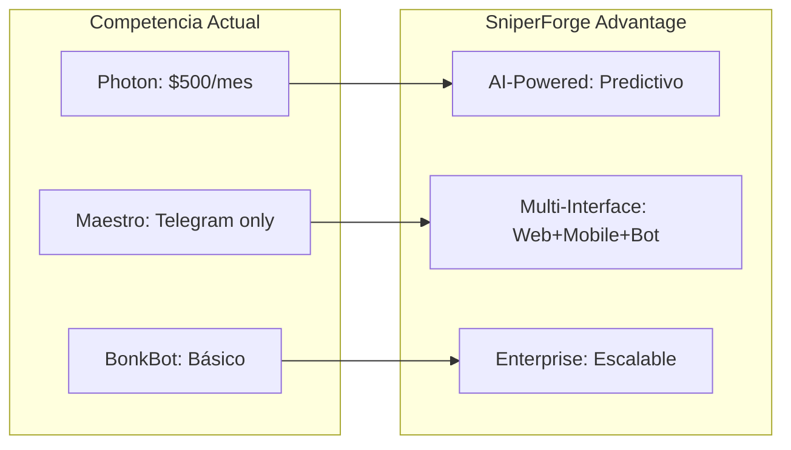
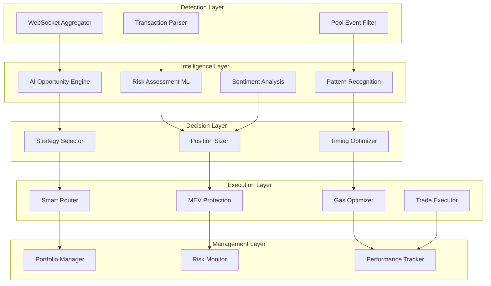
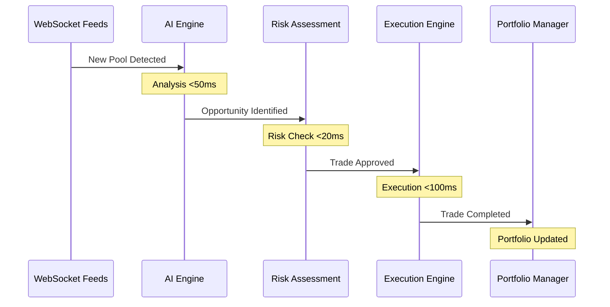
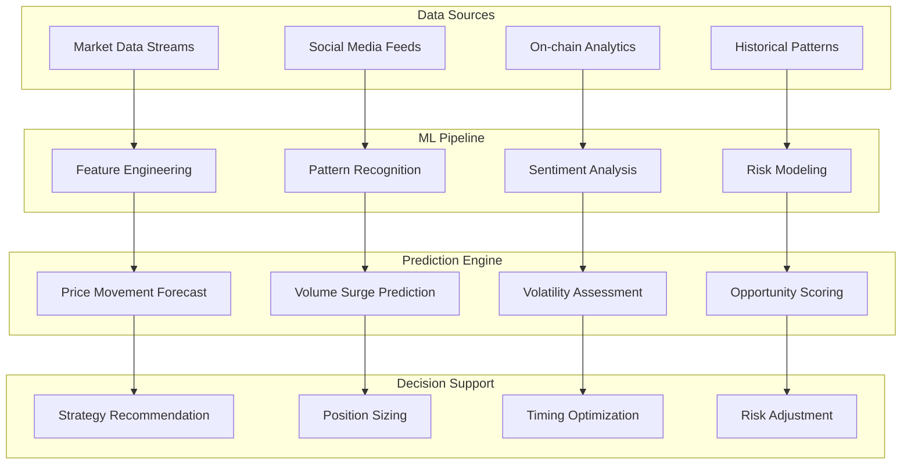
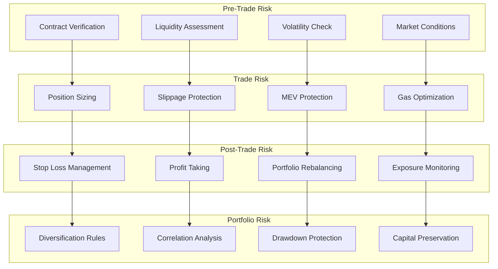

# 🎯 Plan de Implementación: Bot Sniper de Liquidez

**Fecha:** 4 de Agosto, 2025  
**Versión:** 1.0  
**Prioridad:** Alta  

## 📋 Resumen Ejecutivo

El **Bot Sniper de Liquidez** representa la evolución natural de SniperForge hacia un **sistema de clase enterprise** para captura de oportunidades en tiempo real. Inspirado en las mejores prácticas de Photon, Maestro Bot y BonkBot, pero superando sus limitaciones con tecnología de próxima generación.

## 🎯 Filosofía del Diseño

### **Principios Fundamentales**

1. **"Speed is Alpha"** - La velocidad es ventaja competitiva irrefutable
2. **"Intelligence over Brute Force"** - Inteligencia artificial sobre fuerza bruta
3. **"Risk-First Design"** - La gestión de riesgo es prioritaria
4. **"User Experience Excellence"** - Simplicidad sin sacrificar poder

### **Diferenciadores Clave vs. Competencia**



## 🏗️ Arquitectura del Sistema

### **Vista de Alto Nivel**



### **Flujo de Datos en Tiempo Real**



## 🧠 Inteligencia Artificial Integrada

### **Motor de Análisis Predictivo**



### **Capacidades de Inteligencia**

#### **1. Análisis Predictivo Avanzado**
- **Detección de Patrones Complejos** - Identificación de formaciones técnicas en tiempo real
- **Predicción de Movimientos de Precio** - Modelos ML entrenados con datos históricos
- **Análisis de Correlaciones** - Relaciones entre tokens y movimientos de mercado
- **Forecasting de Volatilidad** - Predicción de períodos de alta volatilidad

#### **2. Sentiment Intelligence**
- **Social Media Monitoring** - Twitter, Discord, Telegram en tiempo real
- **News Impact Analysis** - Análisis automático de noticias y anuncios
- **Influencer Tracking** - Seguimiento de wallets y opiniones de influencers
- **FUD/FOMO Detection** - Detección automática de sentimientos extremos

#### **3. Risk Intelligence**
- **Dynamic Risk Scoring** - Evaluación continua basada en múltiples factores
- **Honeypot Detection** - Identificación automática de contratos maliciosos
- **Rugpull Prevention** - Análisis de patrones sospechosos en contratos
- **Market Regime Detection** - Identificación de bull/bear markets

## 🛡️ Sistema de Gestión de Riesgo

### **Framework de Risk Management**



### **Protocolos de Seguridad Multi-Capa**

#### **Layer 1: Contract Security**
- **Automated Code Analysis** - Análisis estático de contratos inteligentes
- **Honeypot Detection** - Verificación de funciones de venta/transferencia
- **Ownership Verification** - Validación de ownership y renunciación
- **Liquidity Lock Verification** - Confirmación de bloqueo de liquidez

#### **Layer 2: Market Security**
- **Liquidity Depth Analysis** - Evaluación de profundidad de mercado
- **Volume Authenticity Check** - Detección de volumen artificial
- **Price Impact Assessment** - Cálculo de impacto en precio por tamaño
- **Market Manipulation Detection** - Identificación de patrones sospechosos

#### **Layer 3: Execution Security**
- **MEV Protection Suite** - Protección multi-vector contra MEV
- **Frontrunning Prevention** - Técnicas anti-frontrunning
- **Sandwich Attack Protection** - Detección y prevención de ataques sandwich
- **Gas Price Optimization** - Optimización inteligente de gas fees

#### **Layer 4: Portfolio Security**
- **Position Limits Enforcement** - Límites automáticos por posición
- **Correlation Risk Management** - Gestión de riesgo de correlación
- **Drawdown Protection** - Protección automática contra pérdidas
- **Emergency Stop Mechanisms** - Mecanismos de parada de emergencia

## 📊 Configuración y Parámetros

### Performance Parameters
```rust
pub struct SniperConfig {
    // Detection
    pub max_detection_latency_ms: u64,        // 500ms
    pub websocket_connections: usize,         // 3
    pub detection_buffer_size: usize,         // 1000
    
    // Analysis
    pub max_analysis_time_ms: u64,           // 100ms
    pub min_profit_threshold: f64,           // 0.15 (15%)
    pub max_risk_score: f64,                 // 0.7
    
    // Execution
    pub max_execution_time_ms: u64,          // 200ms
    pub priority_fee_lamports: u64,          // 100000
    pub max_slippage_bps: u16,              // 50 (0.5%)
    
    // Risk Management
    pub max_position_size_sol: f64,          // 10.0
    pub max_daily_trades: usize,             // 100
    pub stop_loss_percentage: f64,           // 0.05 (5%)
}
```

### Pool Filtering Criteria
```rust
pub struct PoolFilter {
    pub min_liquidity_sol: f64,              // 50.0
    pub min_volume_24h_sol: f64,             // 100.0
    pub max_age_minutes: u64,                // 60
    pub required_dex_programs: Vec<Pubkey>,  // Raydium, Orca
    pub blacklisted_tokens: HashSet<Pubkey>, // Known scams
    pub min_holders: usize,                  // 100
}
```

## 🧪 Testing Strategy

### Unit Tests
```rust
#[cfg(test)]
mod tests {
    use super::*;
    
    #[tokio::test]
    async fn test_pool_detection_speed() {
        let detector = NewPoolDetector::new_test();
        let start = Instant::now();
        
        let pools = detector.detect_new_pools().await.unwrap();
        let detection_time = start.elapsed();
        
        assert!(detection_time < Duration::from_millis(500));
        assert!(pools.len() > 0);
    }
    
    #[tokio::test]
    async fn test_opportunity_analysis_speed() {
        let analyzer = OpportunityAnalyzer::new_test();
        let mock_pool = create_mock_pool_event();
        
        let start = Instant::now();
        let opportunity = analyzer.analyze_opportunity(&mock_pool).await.unwrap();
        let analysis_time = start.elapsed();
        
        assert!(analysis_time < Duration::from_millis(100));
        assert!(opportunity.is_some());
    }
    
    #[tokio::test]
    async fn test_execution_speed() {
        let executor = TradeExecutor::new_test();
        let mock_opportunity = create_mock_opportunity();
        let test_wallet = create_test_wallet();
        
        let start = Instant::now();
        let result = executor.execute_sniper_trade(&mock_opportunity, &test_wallet).await.unwrap();
        let execution_time = start.elapsed();
        
        assert!(execution_time < Duration::from_millis(200));
        assert!(result.signature.len() > 0);
    }
}
```

### Integration Tests
- End-to-end sniper flow testing
- WebSocket connection resilience
- MEV protection effectiveness
- Risk management validation

### Performance Tests
- Load testing with 1000+ pools/minute
- Latency testing under stress
- Memory usage optimization
- CPU utilization monitoring

## 📋 Implementation Roadmap

### Week 1: Core Infrastructure
- [ ] **Day 1-2:** NewPoolDetector implementation
- [ ] **Day 3-4:** OpportunityAnalyzer implementation  
- [ ] **Day 5-7:** Basic testing and integration

### Week 2: Execution Engine
- [ ] **Day 8-9:** TradeExecutor implementation
- [ ] **Day 10-11:** MEV protection integration
- [ ] **Day 12-14:** Execution testing and optimization

### Week 3: Risk Management
- [ ] **Day 15-16:** RiskManager implementation
- [ ] **Day 17-18:** Position management system
- [ ] **Day 19-21:** Risk testing and validation

### Week 4: Integration & Testing
- [ ] **Day 22-23:** Full system integration
- [ ] **Day 24-25:** Performance optimization
- [ ] **Day 26-28:** Comprehensive testing

## 🎯 Success Metrics

### Performance KPIs
- **Pool Detection Latency:** <500ms (target: 300ms)
- **Analysis Speed:** <100ms (target: 80ms)  
- **Execution Speed:** <200ms (target: 150ms)
- **Success Rate:** >80% profitable trades

### Financial KPIs
- **Average Profit per Trade:** 15%+
- **Daily Revenue:** $1,000+ 
- **Win Rate:** >70%
- **Sharpe Ratio:** >2.0

### Risk KPIs
- **Maximum Drawdown:** <5%
- **Risk-Adjusted Returns:** >150%
- **Position Limits:** Never exceeded
- **Stop Loss Triggers:** <10% of trades

## 🔧 Deployment Strategy

### Development Environment
- Local testing with devnet
- Mock WebSocket feeds
- Simulated trading

### Staging Environment  
- Mainnet monitoring (read-only)
- Real WebSocket feeds
- Paper trading with real data

### Production Environment
- Live mainnet trading
- Real capital deployment
- Full monitoring and alerting

## ⚠️ Risk Considerations

### Technical Risks
- **WebSocket disconnections:** Mitigated with multiple connections
- **RPC failures:** Mitigated with connection pool failover
- **MEV attacks:** Mitigated with protection algorithms

### Financial Risks
- **Market volatility:** Mitigated with stop losses
- **Liquidity risks:** Mitigated with position sizing
- **Concentration risk:** Mitigated with exposure limits

### Operational Risks
- **System downtime:** Mitigated with monitoring and alerting
- **Configuration errors:** Mitigated with validation and testing
- **Human error:** Mitigated with automation and safeguards

---

**Estado:** ✅ Plan listo para implementación  
**Prioridad:** Alta  
**Estimación:** 4 semanas desarrollo  
**ROI Estimado:** 300%+ anual  
**Riesgo:** Medio (mitigado con controles)  
