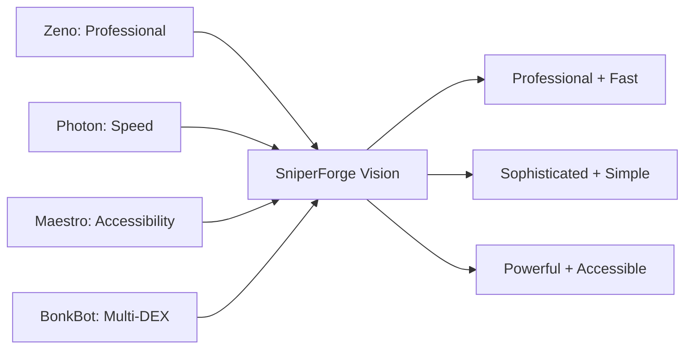
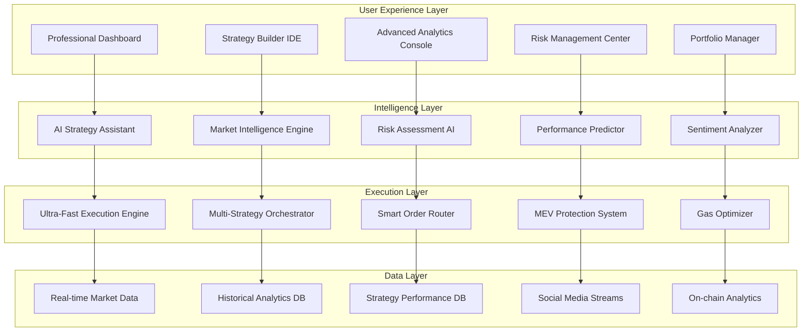
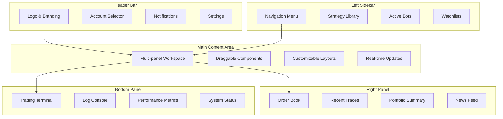
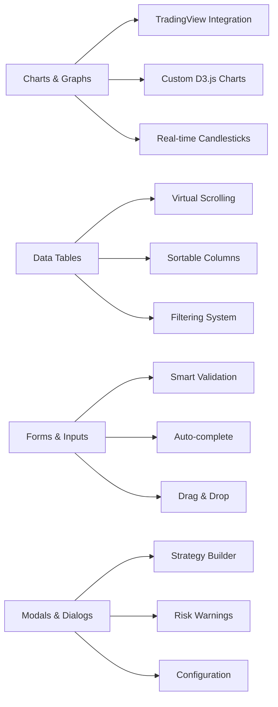
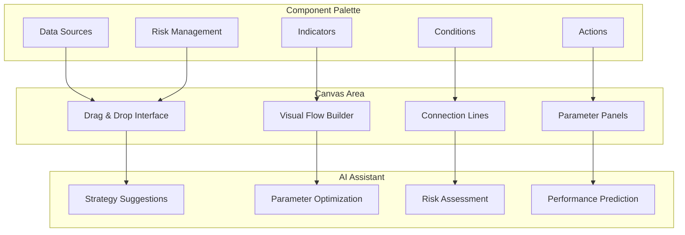
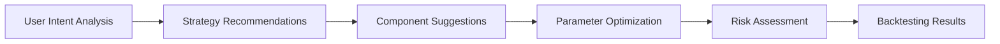
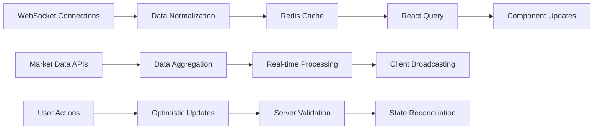

# 🎯 Professional Trading Suite - Especificación Técnica

**Fecha:** 4 de Agosto, 2025  
**Versión:** 1.0  
**Inspirado en:** Zeno Trading + Innovaciones SniperForge  

## 📋 Visión del Producto

Crear una **plataforma de trading profesional** que combine la sofisticación de Zeno Trading con la velocidad ultra-optimizada de SniperForge, superando las limitaciones de ambos enfoques.

### **Filosofía de Diseño**



## 🏗️ Arquitectura del Professional Trading Suite

### **Core Components Overview**



## 🎨 Professional Dashboard Design

### **Main Dashboard Layout**



### **Component Design System**

#### **Color Palette - Professional Dark Theme**
- **Primary:** `#1a1d29` (Dark Background)
- **Secondary:** `#252830` (Panel Background)
- **Accent:** `#3b82f6` (Blue Interactive Elements)
- **Success:** `#10b981` (Profit/Success)
- **Danger:** `#ef4444` (Loss/Danger)
- **Warning:** `#f59e0b` (Caution)
- **Text Primary:** `#f8fafc` (Main Text)
- **Text Secondary:** `#94a3b8` (Secondary Text)

#### **Typography System**
- **Headers:** Inter/SF Pro Display
- **Body:** Inter/SF Pro Text
- **Monospace:** JetBrains Mono (Numbers/Codes)

#### **Component Library**


## 🧠 AI-Enhanced Strategy Builder

### **Visual Strategy Construction**



### **Strategy Components Library**

#### **Data Sources**
- **Market Data:** Price, Volume, OHLCV, Order Book
- **Social Data:** Twitter sentiment, Discord activity, Telegram signals
- **On-chain Data:** Wallet movements, Token holders, Liquidity changes
- **News Data:** Crypto news, Announcements, FUD/FOMO events

#### **Technical Indicators**
- **Trend:** EMA, SMA, MACD, Bollinger Bands, Ichimoku
- **Momentum:** RSI, Stochastic, Williams %R, CCI
- **Volume:** Volume Profile, OBV, Accumulation/Distribution
- **Custom:** User-defined indicators with formula editor

#### **Conditions & Logic**
- **Price Conditions:** Above/Below, Crossover, Percentage change
- **Time Conditions:** Time of day, Day of week, Market hours
- **Volume Conditions:** Volume spike, Volume above average
- **Complex Logic:** AND/OR combinations, Nested conditions

#### **Actions & Execution**
- **Trading Actions:** Buy, Sell, Stop Loss, Take Profit
- **Position Management:** Size adjustment, Partial close, Hedge
- **Notifications:** Email, SMS, Discord, Telegram alerts
- **Custom Scripts:** JavaScript execution environment

### **AI Strategy Assistant Features**

#### **Intelligent Suggestions**


#### **Auto-Optimization Engine**
- **Parameter Tuning:** Genetic algorithms for parameter optimization
- **Market Adaptation:** Automatic strategy adjustment based on market conditions
- **Performance Tracking:** Continuous monitoring and improvement suggestions
- **Risk Adjustment:** Dynamic risk parameter modification

## 📊 Advanced Analytics Console

### **Performance Analytics**

```mermaid
graph TB
    subgraph "Portfolio Metrics"
        A[Total PnL]
        B[Sharpe Ratio]
        C[Maximum Drawdown]
        D[Win Rate]
        E[Average Trade]
    end
    
    subgraph "Risk Metrics"
        F[VaR (Value at Risk)]
        G[Expected Shortfall]
        H[Beta vs SOL]
        I[Correlation Matrix]
        J[Concentration Risk]
    end
    
    subgraph "Execution Metrics"
        K[Latency Statistics]
        L[Slippage Analysis]
        M[Fill Rate]
        N[MEV Protection Rate]
        O[Gas Efficiency]
    end
    
    subgraph "Strategy Metrics"
        P[Strategy Performance]
        Q[Attribution Analysis]
        R[Factor Exposure]
        S[Alpha Generation]
        T[Information Ratio]
    end
    
    A --> F
    B --> G
    C --> H
    D --> I
    E --> J
    
    F --> K
    G --> L
    H --> M
    I --> N
    J --> O
    
    K --> P
    L --> Q
    M --> R
    N --> S
    O --> T
```

### **Real-time Risk Dashboard**

#### **Risk Monitoring Components**
- **Position Heat Map:** Visual representation of position sizes and risks
- **Correlation Matrix:** Real-time correlation between holdings
- **Stress Testing:** What-if scenarios with market stress conditions
- **Limit Monitoring:** Real-time tracking of risk limits and breaches

#### **Risk Controls**
- **Dynamic Position Sizing:** AI-driven position size recommendations
- **Auto-Hedging:** Automatic hedging when risk thresholds are breached
- **Stop Loss Optimization:** AI-optimized stop loss levels
- **Exposure Limits:** Automatic enforcement of exposure limits

## 🔧 Technical Implementation

### **Frontend Technology Stack**

#### **Core Framework**
```typescript
// React + TypeScript + Vite
interface TradingPlatformConfig {
  framework: 'React 18';
  language: 'TypeScript 5.0';
  bundler: 'Vite 4.0';
  styling: 'Tailwind CSS + Styled Components';
  charts: 'TradingView Charting Library + D3.js';
  state: 'Zustand + React Query';
  websockets: 'Socket.io-client + RxJS';
}
```

#### **Performance Optimizations**
- **Virtual Scrolling:** For large data tables
- **Canvas Rendering:** For high-performance charts
- **Web Workers:** For heavy computations
- **Service Workers:** For offline capabilities
- **Code Splitting:** Dynamic imports for features

### **Real-time Data Architecture**



### **Backend Integration**

#### **API Design**
```graphql
# GraphQL Schema Example
type Strategy {
  id: ID!
  name: String!
  description: String
  components: [StrategyComponent!]!
  performance: PerformanceMetrics!
  riskProfile: RiskProfile!
  isActive: Boolean!
  createdAt: DateTime!
  updatedAt: DateTime!
}

type StrategyComponent {
  id: ID!
  type: ComponentType!
  configuration: JSON!
  connections: [ComponentConnection!]!
}

type Query {
  strategies: [Strategy!]!
  strategy(id: ID!): Strategy
  backtestStrategy(input: BacktestInput!): BacktestResult!
}

type Mutation {
  createStrategy(input: CreateStrategyInput!): Strategy!
  updateStrategy(id: ID!, input: UpdateStrategyInput!): Strategy!
  activateStrategy(id: ID!): Boolean!
  deactivateStrategy(id: ID!): Boolean!
}
```

## 🎯 Competitive Advantages vs. Zeno

### **Feature Comparison Matrix**

| Feature | Zeno Trading | SniperForge Professional Suite |
|---------|-------------|-------------------------------|
| **Learning Curve** | Steep (weeks) | Gradual (days to weeks) |
| **Strategy Builder** | Complex pro tool | AI-assisted + Visual |
| **Speed** | 800-1200ms | <50ms target |
| **AI Integration** | Basic analytics | Full AI assistant |
| **Mobile Support** | Limited | Native mobile app |
| **Pricing** | $300-1000/month | $100-400/month |
| **Solana Optimization** | Multi-chain diluted | Solana-native optimized |
| **Community** | Closed ecosystem | Open marketplace |

### **Unique Value Propositions**

#### **1. AI-First Approach**
- **Strategy Intelligence:** AI suggests optimal strategies based on market conditions
- **Risk Intelligence:** ML-powered risk assessment and management
- **Performance Intelligence:** Predictive analytics for strategy performance

#### **2. Speed + Sophistication**
- **Professional Interface:** Zeno-level sophistication
- **Ultra-Low Latency:** Sub-50ms execution
- **Real-time Everything:** All data updates in real-time

#### **3. Accessibility Gradient**
- **Beginner Mode:** Simple interface with guided setup
- **Intermediate Mode:** Visual strategy builder with AI assistance
- **Professional Mode:** Full feature set with advanced analytics
- **Expert Mode:** API access and custom development tools

## 📋 Implementation Roadmap

### **Phase 1: Core Platform (Weeks 1-4)**
- [ ] **Week 1:** Professional dashboard foundation
- [ ] **Week 2:** Basic strategy builder implementation
- [ ] **Week 3:** Real-time data integration
- [ ] **Week 4:** Basic analytics and charting

### **Phase 2: AI Integration (Weeks 5-8)**
- [ ] **Week 5:** AI strategy assistant core
- [ ] **Week 6:** ML-powered risk assessment
- [ ] **Week 7:** Performance prediction engine
- [ ] **Week 8:** Auto-optimization features

### **Phase 3: Advanced Features (Weeks 9-12)**
- [ ] **Week 9:** Advanced analytics console
- [ ] **Week 10:** Strategy marketplace
- [ ] **Week 11:** Mobile app development
- [ ] **Week 12:** API and integrations

### **Phase 4: Enterprise Features (Weeks 13-16)**
- [ ] **Week 13:** Multi-account management
- [ ] **Week 14:** White-label solutions
- [ ] **Week 15:** Compliance and audit tools
- [ ] **Week 16:** Advanced security features

## 🎯 Success Metrics

### **User Experience KPIs**
- **Time to First Strategy:** <30 minutes (vs. Zeno's hours)
- **User Retention:** >80% monthly (vs. industry 60%)
- **Strategy Success Rate:** >75% profitable (vs. market 50-60%)
- **Support Ticket Reduction:** 70% fewer than complex platforms

### **Performance KPIs**
- **Platform Latency:** <50ms end-to-end
- **Uptime:** >99.9%
- **Data Accuracy:** >99.95%
- **Real-time Data Lag:** <10ms

### **Business KPIs**
- **User Acquisition Cost:** 40% lower than premium competitors
- **Customer Lifetime Value:** 200% higher than basic bots
- **Churn Rate:** <5% monthly
- **Revenue per User:** $200-400/month average

---

**Estado:** ✅ Especificación técnica completa  
**Inspiración:** Zeno Trading professional features + SniperForge innovations  
**Diferenciación:** AI-first, ultra-fast, accessible professional platform  
**Market Opportunity:** $100M+ TAM in professional trading tools  
